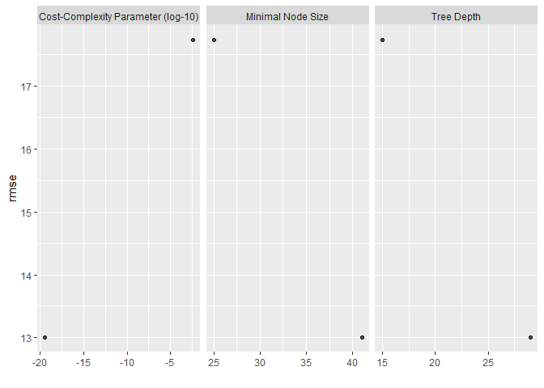
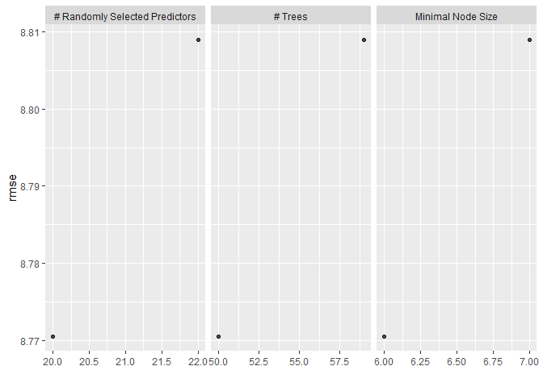
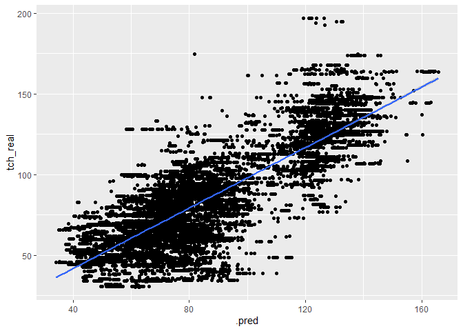
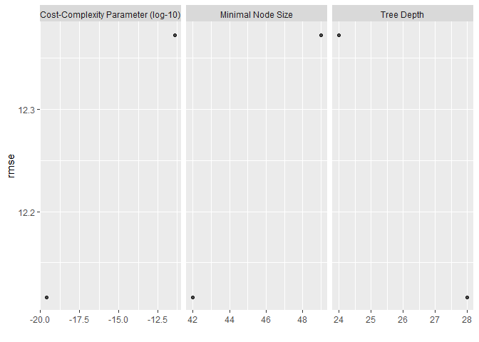
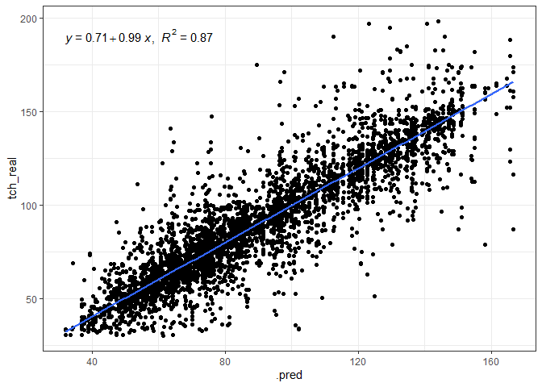

<!-- README.md is generated from README.Rmd. Please edit that file -->

# bigdata-sugarcane

### Carregando os pacotes

``` r
library("tidymodels")

library("tidyverse")
library("agricolae")
library("gclus")
library("cluster")
library("vegan")
library("lattice")
library("nortest")
library("rio")
library("gganimate")
library("corrplot")

library(readxl)
library(tidyverse)
library(geobr)
library(skimr)
library(ISLR)
library(modeldata)
library(vip)
library(ggpubr)
library(rpart.plot)
```

# Análise iniciais, básicas

### Carregando o banco de dados

``` r
data_set <-  readxl::read_xlsx("data/Big_03.xlsx",
                               na = "NA")
glimpse(data_set)
#> Rows: 53,654
#> Columns: 112
#> $ Chave          <dbl> 4412213, 4412213, 4412213, 4412314, 4412314, 4412313, 4~
#> $ FAZENDA        <dbl> 44122, 44122, 44122, 44123, 44123, 44123, 44123, 44123,~
#> $ QUADRA         <dbl> 1, 1, 1, 1, 1, 1, 1, 1, 1, 1, 1, 1, 1, 1, 1, 1, 1, 1, 1~
#> $ TALHAO         <dbl> 3, 3, 3, 4, 4, 3, 4, 2, 7, 2, 7, 11, 4, 5, 11, 7, 4, 2,~
#> $ FAZ_QUADRA     <dbl> 441221, 441221, 441221, 441231, 441231, 441231, 441231,~
#> $ FAZ_TALHAO     <dbl> 441223, 441223, 441223, 441234, 441234, 441233, 441234,~
#> $ UNIDADE        <chr> "CAT", "CAT", "CAT", "CAT", "CAT", "CAT", "CAT", "CAT",~
#> $ ponto          <chr> "CF1659867", "CF1659868", "CF1659869", "CF1659881", "CF~
#> $ X              <dbl> -49.01182, -49.00969, -49.01071, -48.99698, -48.99910, ~
#> $ Y              <dbl> -21.57020, -21.56957, -21.56829, -21.56793, -21.56784, ~
#> $ DATA           <dttm> 2016-10-27, 2016-10-27, 2016-10-27, 2016-11-22, 2016-1~
#> $ Ph_Cacl2_1     <dbl> 5.00, 4.98, 5.11, 5.52, 6.10, 5.82, 5.74, 5.77, 5.57, 5~
#> $ MO_1           <dbl> 21.2162, 18.8782, 14.4360, 13.3452, 14.2404, 12.6738, 1~
#> $ P_resina_1     <dbl> 9.27646, 8.75594, 7.06425, 10.53918, 10.53918, 10.67452~
#> $ S_1            <dbl> 7.83005, 5.42264, 5.21330, 5.29928, 4.67093, 11.45711, ~
#> $ Ca_1           <dbl> 13.952941, 10.964706, 13.435294, 11.517857, 20.000000, ~
#> $ Mg_1           <dbl> 5.314685, 6.503497, 6.923077, 4.635821, 11.620896, 6.49~
#> $ K_1            <dbl> 0.9774991, 1.1887667, 0.5687049, 0.6072340, 0.5987234, ~
#> $ Al_1           <dbl> 0.480, 0.576, 0.384, 0.576, 0.672, 0.384, 0.480, 0.480,~
#> $ H_Al_1         <dbl> 19.60717, 16.05187, 14.44755, 14.83242, 13.21014, 12.53~
#> $ SB_1           <dbl> 20.24513, 18.65697, 20.92708, 16.76091, 32.21962, 24.03~
#> $ CTC_1          <dbl> 39.85229, 34.70883, 35.37463, 31.59333, 45.42976, 36.57~
#> $ V_1            <dbl> 50.80041, 53.75280, 59.15843, 53.05206, 70.92183, 65.73~
#> $ m_1            <dbl> 2.3160294, 2.9948574, 1.8018799, 3.3223910, 2.0430737, ~
#> $ B_1            <dbl> NA, NA, NA, NA, NA, 0.2501072, NA, NA, NA, NA, NA, NA, ~
#> $ Cu_1           <dbl> NA, NA, NA, NA, NA, 0.7327344, NA, NA, NA, NA, NA, NA, ~
#> $ Fe_1           <dbl> NA, NA, NA, NA, NA, 42.09182, NA, NA, NA, NA, NA, NA, N~
#> $ Mn_1           <dbl> NA, NA, NA, NA, NA, 3.253708, NA, NA, NA, NA, NA, NA, N~
#> $ Zn_1           <dbl> NA, NA, NA, NA, NA, 0.3504326, NA, NA, NA, NA, NA, NA, ~
#> $ Estagio        <dbl> 5, 5, 5, 5, 5, 5, 5, 5, 5, 5, 5, 5, 5, 5, 5, 5, 5, 5, 5~
#> $ Estagio_OP     <chr> "Soca", "Soca", "Soca", "Soca", "Soca", "Soca", "Soca",~
#> $ Ph_Cacl2_2     <dbl> 4.53, 5.00, 5.16, 5.71, 6.21, 6.11, 5.87, 5.68, 5.50, 5~
#> $ MO_2           <dbl> 17.0078, 12.5656, 11.3966, 11.1072, 16.4784, 11.7786, 1~
#> $ P_resina_2     <dbl> 7.19438, 6.41360, 6.28347, 12.43394, 11.08054, 10.40384~
#> $ S_2            <dbl> 7.62071, 6.46934, 8.03939, 4.79660, 4.79660, 5.04794, 5~
#> $ Ca_2           <dbl> 8.894118, 11.341176, 12.164706, 12.767857, 18.750000, 1~
#> $ Mg_2           <dbl> 4.973776, 6.354895, 6.232517, 5.282587, 12.536318, 7.19~
#> $ K_2            <dbl> 0.73703195, 0.97062865, 0.23033322, 0.57744681, 0.61148~
#> $ Al_2           <dbl> 2.016, 0.768, 0.288, 0.480, 0.576, 0.576, 0.576, 0.576,~
#> $ H_Al_2         <dbl> 18.02311, 15.71735, 12.73259, 14.83242, 12.14291, 11.52~
#> $ SB_2           <dbl> 14.60493, 18.66670, 18.62756, 18.62789, 31.89781, 24.63~
#> $ CTC_2          <dbl> 32.62804, 34.38405, 31.36015, 33.46031, 44.04071, 36.15~
#> $ V_2            <dbl> 44.76188, 54.28884, 59.39881, 55.67161, 72.42800, 68.13~
#> $ m_2            <dbl> 12.129288, 3.951695, 1.522556, 2.512051, 1.773737, 2.28~
#> $ B_2            <dbl> NA, NA, NA, NA, NA, 0.2696464, NA, NA, NA, NA, NA, NA, ~
#> $ Cu_2           <dbl> NA, NA, NA, NA, NA, 0.4576081, NA, NA, NA, NA, NA, NA, ~
#> $ Fe_2           <dbl> NA, NA, NA, NA, NA, 31.75250, NA, NA, NA, NA, NA, NA, N~
#> $ Mn_2           <dbl> NA, NA, NA, NA, NA, 2.480874, NA, NA, NA, NA, NA, NA, N~
#> $ Zn_2           <dbl> NA, NA, NA, NA, NA, 0.2906881, NA, NA, NA, NA, NA, NA, ~
#> $ Ph_Cacl2_M     <dbl> 4.765, 4.990, 5.135, 5.615, 6.155, 5.965, 5.805, 5.725,~
#> $ MO_Media       <dbl> 19.1120, 15.7219, 12.9163, 12.2262, 15.3594, 12.2262, 1~
#> $ P_Media        <dbl> 8.235420, 7.584770, 6.673860, 11.486560, 10.809860, 10.~
#> $ S_Media        <dbl> 7.725380, 5.945990, 6.626345, 5.047940, 4.733765, 8.252~
#> $ Ca_Media       <dbl> 11.42353, 11.15294, 12.80000, 12.14286, 19.37500, 17.00~
#> $ Mg_Media       <dbl> 5.144231, 6.429196, 6.577797, 4.959204, 12.078607, 6.84~
#> $ K_Media        <dbl> 0.85726554, 1.07969770, 0.39951907, 0.59234043, 0.60510~
#> $ Al_Media       <dbl> 1.248, 0.672, 0.336, 0.528, 0.624, 0.480, 0.528, 0.528,~
#> $ H_Al_Media     <dbl> 18.81514, 15.88461, 13.59007, 14.83242, 12.67653, 12.02~
#> $ SB_Media       <dbl> 17.42503, 18.66183, 19.77732, 17.69440, 32.05871, 24.33~
#> $ CTC_Media      <dbl> 36.24017, 34.54644, 33.36739, 32.52682, 44.73524, 36.36~
#> $ V_Media        <dbl> 47.78114, 54.02082, 59.27862, 54.36183, 71.67491, 66.93~
#> $ m_Media        <dbl> 7.222659, 3.473276, 1.662218, 2.917221, 1.908405, 1.928~
#> $ B_Media        <dbl> NA, NA, NA, NA, NA, 0.2598768, NA, NA, NA, NA, NA, NA, ~
#> $ Cu_Media       <dbl> NA, NA, NA, NA, NA, 0.5951713, NA, NA, NA, NA, NA, NA, ~
#> $ Fe_Media       <dbl> NA, NA, NA, NA, NA, 36.92216, NA, NA, NA, NA, NA, NA, N~
#> $ Mn_Media       <dbl> NA, NA, NA, NA, NA, 2.867291, NA, NA, NA, NA, NA, NA, N~
#> $ Zn_Media       <dbl> NA, NA, NA, NA, NA, 0.3205604, NA, NA, NA, NA, NA, NA, ~
#> $ CP_Cal_OP      <dbl> 3358.0600, 3104.4658, 2655.5507, 3224.4847, 0.0000, 153~
#> $ CP_Rec_V_O     <dbl> 750, 0, 0, 0, 0, 0, 0, 0, 0, 0, 0, 0, 0, 0, 750, 0, 0, ~
#> $ CP_Rec_OP      <dbl> 750, 750, 750, 750, 750, 750, 750, 750, 750, 750, 750, ~
#> $ Composto       <dbl> 2000, 2000, 2000, 1400, 1400, 1400, 1400, 1400, 1400, 2~
#> $ Agrofos        <dbl> 1100, 1100, 1100, 750, 750, 750, 750, 750, 750, 1100, 7~
#> $ CS_Cal_OP      <dbl> 1341.5467, 1566.4747, 1205.2036, 1730.7902, 0.0000, 795~
#> $ CS_Rec_OP      <dbl> 750, 750, 750, 750, 750, 750, 750, 750, 750, 750, 750, ~
#> $ CS_Rec_V_O     <dbl> 750, 0, 0, 0, 0, 0, 0, 0, 0, 0, 0, 0, 0, 0, 750, 0, 0, ~
#> $ Fosfato        <lgl> NA, NA, NA, NA, NA, NA, NA, NA, NA, NA, NA, NA, NA, NA,~
#> $ ANO            <dbl> 2016, 2016, 2016, 2016, 2016, 2016, 2016, 2016, 2016, 2~
#> $ chave          <dbl> 4412213, 4412213, 4412213, 4412314, 4412314, 4412313, 4~
#> $ unidade        <chr> "CAT", "CAT", "CAT", "CAT", "CAT", "CAT", "CAT", "CAT",~
#> $ ano            <dbl> 2016, 2016, 2016, 2016, 2016, 2016, 2016, 2016, 2016, 2~
#> $ mes            <dbl> 10, 10, 10, 10, 10, 10, 10, 10, 10, 10, 10, 10, 10, 10,~
#> $ fazenda        <dbl> 44122, 44122, 44122, 44123, 44123, 44123, 44123, 44123,~
#> $ quadra         <dbl> 1, 1, 1, 1, 1, 1, 1, 1, 1, 1, 1, 1, 1, 1, 1, 1, 1, 1, 1~
#> $ talhao         <dbl> 3, 3, 3, 4, 4, 3, 4, 2, 7, 2, 7, 11, 4, 5, 11, 7, 4, 2,~
#> $ area_ha        <dbl> 9.54, 9.54, 9.54, 13.55, 13.55, 5.65, 13.55, 2.04, 15.1~
#> $ variedade      <chr> "SP81-3250", "SP81-3250", "SP81-3250", "SP86-155", "SP8~
#> $ corte          <chr> "5ºC", "5ºC", "5ºC", "5ºC", "5ºC", "5ºC", "5ºC", "5ºC",~
#> $ distancia      <dbl> 85, 85, 85, 84, 84, 84, 84, 84, 84, 85, 84, 84, 84, 84,~
#> $ idade_obje     <dbl> 7.0, 7.0, 7.0, 6.8, 6.8, 6.8, 6.8, 6.8, 6.8, 7.0, 6.8, ~
#> $ tch_objeti     <dbl> 50, 50, 50, 66, 66, 66, 66, 66, 66, 50, 66, 66, 66, 66,~
#> $ tc_objetiv     <dbl> 477.00, 477.00, 477.00, 894.30, 894.30, 372.90, 894.30,~
#> $ porcent_ob     <dbl> 0.07, 0.07, 0.07, 0.13, 0.13, 0.05, 0.13, 0.02, 0.14, 0~
#> $ idade_real     <dbl> 13.3, 13.3, 13.3, 13.2, 13.2, 13.2, 13.2, 13.2, 13.2, 1~
#> $ tch_real       <dbl> 51.13, 51.13, 51.13, 49.76, 49.76, 49.78, 49.76, 49.87,~
#> $ tc_real        <dbl> 487.75, 487.75, 487.75, 674.21, 674.21, 281.25, 674.21,~
#> $ porcent_re     <dbl> 0.08, 0.08, 0.08, 0.11, 0.11, 0.04, 0.11, 0.02, 0.12, 0~
#> $ variacao_p     <dbl> 2.25, 2.25, 2.25, -24.61, -24.61, -24.58, -24.61, -24.4~
#> $ variacao_t     <dbl> 10.75, 10.75, 10.75, -220.09, -220.09, -91.65, -220.09,~
#> $ aplic_vinh     <chr> "NAO", "NAO", "NAO", "NAO", "NAO", "NAO", "NAO", "NAO",~
#> $ consumo_to     <dbl> 0, 0, 0, 0, 0, 0, 0, 0, 0, 0, 0, 0, 0, 0, 0, 0, 0, 0, 0~
#> $ consumo_me     <dbl> 0, 0, 0, 0, 0, 0, 0, 0, 0, 0, 0, 0, 0, 0, 0, 0, 0, 0, 0~
#> $ data_vinha     <dbl> NA, NA, NA, NA, NA, NA, NA, NA, NA, NA, NA, NA, NA, NA,~
#> $ atr            <dbl> 150.57, 150.57, 150.57, 148.36, 148.36, 148.36, 148.36,~
#> $ tch_idade_real <dbl> 3.844361, 3.844361, 3.844361, 3.769697, 3.769697, 3.771~
#> $ solos          <chr> "LVd md", "LVd md", "LVd md", "LVPd md/md-arg", "LVPd m~
#> $ manejo         <chr> "LVd + al md", "LVd + al md", "LVd + al md", "LVPd + al~
#> $ ambiente       <chr> "D", "D", "D", "C", "C", "C", "C", "C", "C", "C", "C", ~
#> $ textura_1      <chr> "Media", "Media", "Media", "Media", "Media", "Media", "~
#> $ textura_2      <chr> "Media", "Media", "Media", "Media-Argilosa", "Media-Arg~
#> $ nematoide      <chr> NA, NA, NA, NA, NA, NA, NA, NA, NA, NA, NA, NA, NA, NA,~
#> $ migdolus       <chr> "Ausente", "Ausente", "Ausente", "Ausente", "Ausente", ~
#> $ sphenophorus   <chr> NA, NA, NA, NA, NA, NA, NA, NA, NA, NA, NA, NA, NA, NA,~
```

## Preparando o banco de dados

``` r
data_set[25795,names(data_set)=="B_2"] <- NA
data_set[6,names(data_set)=="B_2"]
#> # A tibble: 1 x 1
#>     B_2
#>   <dbl>
#> 1 0.270
data_set$B_2<-as.numeric(as.character(data_set$B_2))
```

``` r
data_set[18854,names(data_set)=="Cu_1"| names(data_set)=="Fe_1" | names(data_set)=="Mn_1" | names(data_set)=="Zn_1"]<-NA
data_set[27272,names(data_set)=="Cu_1"| names(data_set)=="Fe_1" | names(data_set)=="Mn_1" | names(data_set)=="Zn_1"]<-NA
data_set$Cu_1<-as.numeric(as.character(data_set$Cu_1))
data_set$Fe_1<-as.numeric(as.character(data_set$Fe_1))
data_set$Mn_1<-as.numeric(as.character(data_set$Mn_1))
data_set$Zn_1<-as.numeric(as.character(data_set$Zn_1))

UN<-as.character(data_set$UNIDADE)
un<-as.character(data_set$unidade)
UN[is.na(data_set$UNIDADE)]<-un[is.na(data_set$UNIDADE)]
data_set$UNIDADE<-factor(UN)

apv<-as.character(data_set$aplic_vinh)
apv[apv=="Sim"]<-"SIM"
data_set$aplic_vinh<-as.factor(apv)

vari<-sub(" ","",data_set$variedade)
vari<-sub("-","",vari)
vari<-sub("VIVEIRO","Viveiro",vari)
data_set$variedade<-as.factor(vari)

cort<-sub("15M","15m",data_set$corte)
data_set$corte<-as.factor(cort)
```

``` r
#Construindo o vetor numérico referente ao número de cortes
CORTE<-1:length(data_set[,1])
{CORTE[data_set$corte =="10ºC"] =10
CORTE[data_set$corte =="11ºC"] =11
CORTE[data_set$corte =="12m" ] =1
CORTE[data_set$corte =="12mB"] =1.5
CORTE[data_set$corte =="12mT"] =1.75
CORTE[data_set$corte =="15m" ]=1
CORTE[data_set$corte =="15mB" ]=1.5
CORTE[data_set$corte =="18m" ]=1.5
CORTE[data_set$corte =="18mB"] =1.5
CORTE[data_set$corte =="2ºC" ]=2
CORTE[data_set$corte =="2ºCB"] =2.5
CORTE[data_set$corte =="2ºCT"] =2.75
CORTE[data_set$corte =="3ºC"  ]=3
CORTE[data_set$corte =="3ºCB" ]=3.5
CORTE[data_set$corte =="4ºC"  ]=4
CORTE[data_set$corte =="4ºCB" ]=4.5
CORTE[data_set$corte =="5ºC"  ]=5
CORTE[data_set$corte =="5ºCB" ]=5.5
CORTE[data_set$corte =="6ºC"  ]=6
CORTE[data_set$corte =="6ºCB" ]=6.5
CORTE[data_set$corte =="7ºC" ]=7
CORTE[data_set$corte =="7ºCB" ]=7.5
CORTE[data_set$corte =="8ºC"  ]=8
CORTE[data_set$corte =="8ºCB" ]=8.5
CORTE[data_set$corte =="9ºC" ]=9
CORTE[data_set$corte =="9ºCB"] =9.5
CORTE[data_set$corte =="REF" ]=0}
```

``` r
data_set <- data_set %>% 
  janitor::clean_names()
```

## Análise por pontos coincidentes

``` r
# xy<-paste(data_set$X,data_set$Y,sep="") # vetor de caracter único para cada xy
# txy<-table(xy,data_set$ano)# Criamos a tabela de frência para cada coordenada
# fxy<-apply(txy[,1:3],1,sum)==3#filtro somente as coordenadas com a soma igual a 3
# lcoo3<-row.names(txy)[fxy]#Lista das coordenadas que apareceran nos três anos
# length(xy)
# length(lcoo3)
# ff<-vector()
# for( i in 1:length(lcoo3)){
#   f<-which(xy==lcoo3[i])
#   if(sum(data_set$ano[f]==c(2016,2017,2018))==3)  ff<-c(ff,f)
# }
# data_set$CORTE<-CORTE
# dc<-data_set[ff,]
# xyplot(X~Y| factor(ano),data=dc)

# Filtro das variáveis
# names(dc)
top_variedades <- data_set %>% 
  group_by(variedade) %>% 
  summarise(
    n=n()
  ) %>% arrange(desc(n)) %>% 
  head(12) %>% 
  pull(variedade) %>% as.character()

dc <- data_set %>% 
  select(tch_real,atr,corte,variedade,mes,ca_2,m_2,sb_2,idade_real,
              ctc_2,p_resina_2,h_al_2,v_2,k_2,mg_2,mo_2,ph_cacl2_2,s_2,ano) %>%   mutate(
    variedade = forcats::fct_other(variedade, keep = top_variedades, other_level = "outro")) 

# Separar o banco de dados por ano
data_set16<-dc %>% filter(ano==2016) %>% drop_na() %>% select(-ano)
data_set17<-dc %>% filter(ano==2017) %>% drop_na() %>% select(-ano)
data_set18<-dc %>% filter(ano==2018) %>% drop_na() %>% select(-ano)

# length(data_set16[,1]);length(data_set17[,1]);length(data_set18[,1]) # todos com o mesmo número de observações
# dC<-data_set[-ff,]
# length(data_set[,1]) == length(dc[,1]) + length(dC[,1])
# 
# bd<-data_set17
# names(bd)
```

``` r
visdat::vis_miss(data_set16)
```

<!-- -->

``` r
visdat::vis_miss(data_set17)
```

<!-- -->

``` r
visdat::vis_miss(data_set18)
```

<!-- -->

# 2016 par aprevisão de 2017

``` r
data_set_ml <- data_set16
tch_initial_split <- initial_split(data_set_ml, prop = 0.70)
```

``` r
tch_train <- training(tch_initial_split)
tch_train  %>% 
  ggplot(aes(x=tch_real, y=..density..))+
  geom_histogram(bins = 30, color="black",  fill="lightgray")+
  geom_density(alpha=.05,fill="red")+
  theme_bw() +
  labs(x="tch", y = "Densidade")
```

<!-- -->

``` r
tch_recipe <- recipe(tch_real ~ ., data = tch_train ) %>%  
  step_normalize(all_numeric_predictors())  %>% 
  #step_novel(all_nominal_predictors()) %>% 
  step_zv(all_predictors())  #%>%
  #step_naomit(c(Ts, Us)) %>% 
  #step_impute_mean(c(Us,Ts)) %>% 
  #step_poly(c(ms,ts), degree = 5)  
  #step_dummy(all_nominal_predictors())
bake(prep(tch_recipe), new_data = NULL)
#> # A tibble: 14,842 x 18
#>       atr corte variedade    mes    ca_2    m_2     sb_2 idade_real  ctc_2
#>     <dbl> <fct> <fct>      <dbl>   <dbl>  <dbl>    <dbl>      <dbl>  <dbl>
#>  1 -1.27  2ºC   RB92579   -1.08  -0.110  -0.609  0.983       -1.29   0.405
#>  2  1.17  5ºC   RB855453   0.687 -0.925  -0.271 -0.622       -0.308 -0.478
#>  3 -0.972 18m   CTC4      -1.08  -0.538  -0.196 -0.496        0.186 -0.478
#>  4 -1.52  3ºC   SP813250  -1.08   0.100  -0.636  0.0947      -0.907 -0.190
#>  5  0.920 4ºC   RB867515   0.687 -0.0257 -0.531 -0.00216     -0.977  0.147
#>  6  0.719 2ºC   RB92579    0.687 -0.962   0.490 -1.15        -0.625 -1.54 
#>  7 -2.36  3ºCB  RB965902  -1.53   0.332  -0.270  0.0247       2.19  -0.428
#>  8 -0.522 5ºC   RB867515   1.57   0.0624 -0.240 -0.0415       0.820 -0.321
#>  9  2.32  4ºC   SP813250   1.13   2.32   -0.324  2.31        -0.836  3.36 
#> 10 -0.169 2ºC   RB966928  -0.642 -0.714   0.350 -1.01        -1.15  -1.06 
#> # i 14,832 more rows
#> # i 9 more variables: p_resina_2 <dbl>, h_al_2 <dbl>, v_2 <dbl>, k_2 <dbl>,
#> #   mg_2 <dbl>, mo_2 <dbl>, ph_cacl2_2 <dbl>, s_2 <dbl>, tch_real <dbl>
```

``` r
tch_resamples <- vfold_cv(tch_train, v = 5)
grid <- grid_regular(
  penalty(range = c(-10, -2)),
  levels = 5
)
```

## Modelo Decision Tree

``` r
tch_dt_model <- decision_tree(
  cost_complexity = tune(),
  tree_depth = tune(),
  min_n = tune()
)  %>%  
  set_mode("regression")  %>%  
  set_engine("rpart")
```

``` r
tch_dt_recipe <- tch_recipe

tch_dt_wf <- workflow()   %>%  
  add_model(tch_dt_model) %>% 
  add_recipe(tch_dt_recipe)

grid_dt <- grid_random(
  cost_complexity(c(-20, -1)),
  tree_depth(range = c(2, 30)),
  min_n(range = c(2, 60)),
  size = 2
)
```

``` r
tch_dt_tune_grid <- tune_grid(
  tch_dt_wf,
  resamples = tch_resamples,
  grid = grid_dt,
  metrics = metric_set(rmse)
)
autoplot(tch_dt_tune_grid)
```

<!-- -->

``` r
collect_metrics(tch_dt_tune_grid)
#> # A tibble: 2 x 9
#>   cost_complexity tree_depth min_n .metric .estimator  mean     n std_err
#>             <dbl>      <int> <int> <chr>   <chr>      <dbl> <int>   <dbl>
#> 1       0.0000969          5    51 rmse    standard    17.4     5   0.115
#> 2       0.00102           25     3 rmse    standard    15.3     5   0.112
#> # i 1 more variable: .config <chr>

tch_dt_best_params <- select_best(tch_dt_tune_grid, "rmse")
tch_dt_wf <- tch_dt_wf %>% finalize_workflow(tch_dt_best_params)
tch_dt_last_fit <- last_fit(tch_dt_wf, tch_initial_split)

tch_test_preds <- bind_rows(
  collect_predictions(tch_dt_last_fit)  %>%   mutate(modelo = "dt")
)

tch_test <- testing(tch_initial_split)

tch_test_preds %>% 
  ggplot(aes(x=.pred, y=tch_real)) +
  geom_point()+
  theme_bw() +
  geom_smooth(method = "lm") +
  stat_regline_equation(ggplot2::aes(
  label =  paste(..eq.label.., ..rr.label.., sep = "*plain(\",\")~~"))) 
```

<!-- -->

``` r
tch_dt_last_fit_model <- tch_dt_last_fit$.workflow[[1]]$fit$fit
vip(tch_dt_last_fit_model)
```

<!-- -->

``` r
final_wf <- tch_dt_last_fit %>%
  extract_workflow()
final_wf
#> == Workflow [trained] ==========================================================
#> Preprocessor: Recipe
#> Model: decision_tree()
#> 
#> -- Preprocessor ----------------------------------------------------------------
#> 2 Recipe Steps
#> 
#> * step_normalize()
#> * step_zv()
#> 
#> -- Model -----------------------------------------------------------------------
#> n= 14842 
#> 
#> node), split, n, deviance, yval
#>       * denotes terminal node
#> 
#>    1) root 14842 1.399825e+07  91.44674  
#>      2) corte=12m,2ºC,2ºCB,3ºC,3ºCB,4ºC,4ºCB,5ºC,5ºCB,6ºC,6ºCB,7ºC,7ºCB,8ºC,9ºC,9ºCB,REF 11627 6.602588e+06  80.67904  
#>        4) corte=3ºC,4ºC,5ºC,6ºC,6ºCB,7ºC,7ºCB,8ºC,9ºC,9ºCB,REF 7952 3.339952e+06  72.79213  
#>          8) variedade=CV7231,IACSP9550,RB855453,RB855536,RB867515,RB92579,RB965902,SP813250,outro 5246 1.903325e+06  67.39271  
#>           16) corte=4ºC,5ºC,6ºC,7ºCB,9ºC,9ºCB,REF 2700 6.639208e+05  61.19488  
#>             32) mes>=0.9083086 1259 2.876691e+05  55.09879  
#>               64) idade_real< -0.1490219 828 1.271757e+05  51.31679 *
#>               65) idade_real>=-0.1490219 431 1.258977e+05  62.36445  
#>                130) atr< -0.8795637 43 1.159278e+04  43.30070 *
#>                131) atr>=-0.8795637 388 9.694569e+04  64.47719 *
#>             33) mes< 0.9083086 1441 2.885864e+05  66.52102  
#>               66) idade_real< -0.9243444 379 8.040356e+04  58.69544  
#>                132) mes>=0.02255852 124 2.245880e+04  48.37581 *
#>                133) mes< 0.02255852 255 3.831799e+04  63.71361 *
#>               67) idade_real>=-0.9243444 1062 1.766899e+05  69.31377  
#>                134) variedade=CV7231,RB855453,RB92579,SP813250,outro 540 8.788732e+04  65.17100 *
#>                135) variedade=IACSP9550,RB855536,RB867515,RB965902 522 6.994752e+04  73.59939 *
#>           17) corte=3ºC,6ºCB,7ºC,8ºC 2546 1.025700e+06  73.96543  
#>             34) idade_real< -0.607167 565 2.161673e+05  63.09749  
#>               68) mes>=0.4654336 234 4.844510e+04  50.97504 *
#>               69) mes< 0.4654336 331 1.090251e+05  71.66743  
#>                138) variedade=RB855536,SP813250 60 8.202809e+03  55.37867 *
#>                139) variedade=CV7231,IACSP9550,RB855453,RB867515,RB92579,RB965902,outro 271 8.137830e+04  75.27380 *
#>             35) idade_real>=-0.607167 1981 7.237661e+05  77.06507  
#>               70) variedade=CV7231,RB867515,SP813250,outro 736 2.245365e+05  70.27056  
#>                140) idade_real< 0.6967844 626 1.556221e+05  67.42990 *
#>                141) idade_real>=0.6967844 110 3.511601e+04  86.43645  
#>                  282) idade_real>=0.7320263 92 2.015066e+04  81.27717 *
#>                  283) idade_real< 0.7320263 18 2.242778e-02 112.80610 *
#>               71) variedade=IACSP9550,RB855453,RB855536,RB92579,RB965902 1245 4.451654e+05  81.08175  
#>                142) idade_real< 0.09767157 797 2.101832e+05  77.44177  
#>                  284) mes>=0.02255852 656 1.452577e+05  73.90675  
#>                    568) k_2>=-0.7692253 596 1.010428e+05  72.28062 *
#>                    569) k_2< -0.7692253 60 2.698396e+04  90.05967 *
#>                  285) mes< 0.02255852 141 1.858865e+04  93.88837 *
#>                143) idade_real>=0.09767157 448 2.056363e+05  87.55734  
#>                  286) atr< -0.7316226 79 6.307857e+03  67.11861 *
#>                  287) atr>=-0.7316226 369 1.592614e+05  91.93312  
#>                    574) idade_real>=0.3091231 246 1.013572e+05  86.57459 *
#>                    575) idade_real< 0.3091231 123 3.671352e+04 102.65020 *
#>          9) variedade=CTC4,CV7870,RB966928,RB975201 2706 9.871876e+05  83.25974  
#>           18) corte=4ºC,5ºC,6ºC,6ºCB,7ºC,8ºC 1437 4.222807e+05  76.03593  
#>             36) idade_real< -0.1842639 757 2.214990e+05  70.23373  
#>               72) mes>=0.9083086 178 2.244313e+04  55.53146 *
#>               73) mes< 0.9083086 579 1.487515e+05  74.75359  
#> 
#> ...
#> and 84 more lines.


pred <- predict(final_wf, data_set17)
obs <- data_set17 %>% select(tch_real)
cbind(pred, obs) %>% #filter(.pred <=3.75) %>% 
  ggplot(aes(x=.pred, y=tch_real)) +
  geom_point()  +
  geom_smooth(method = "lm")
```

<!-- -->

## Modelo Random Forest

``` r
tch_rf_model <- rand_forest(
  min_n = tune(),
  mtry = tune(),
  trees = tune()
)   %>%  
  set_mode("regression")  %>% 
  set_engine("randomForest")
```

``` r
tch_rf_wf <- workflow()   %>%  
  add_model(tch_rf_model) %>%  
  add_recipe(tch_recipe)
```

``` r
grid_rf <- grid_random(
  min_n(range = c(2, 7)),
  mtry(range = c(20,30)),
  trees(range = c(50,70)),
  size = 2
)
```

``` r
tch_rf_tune_grid <- tune_grid(
 tch_rf_wf,
  resamples = tch_resamples,
  grid = grid_rf,
  metrics = metric_set(rmse)
) 

autoplot(tch_rf_tune_grid)
```

<!-- -->

``` r
tch_rf_best_params <- select_best(tch_rf_tune_grid, "rmse")
tch_rf_wf <- tch_rf_wf %>% finalize_workflow(tch_rf_best_params)
tch_rf_last_fit <- last_fit(tch_rf_wf, tch_initial_split)

tch_test_preds <- bind_rows(
  collect_predictions(tch_rf_last_fit)  %>%   mutate(modelo = "rf")
)
```

``` r
tch_test <- testing(tch_initial_split)

tch_test_preds %>% 
  ggplot(aes(x=.pred, y=tch_real)) +
  geom_point()+
  theme_bw() +
  geom_smooth(method = "lm") +
  stat_regline_equation(ggplot2::aes(
  label =  paste(..eq.label.., ..rr.label.., sep = "*plain(\",\")~~"))) 
```

<!-- -->

``` r
tch_rf_last_fit_model <- tch_rf_last_fit$.workflow[[1]]$fit$fit
vip(tch_rf_last_fit_model)
```

<!-- -->

``` r
final_wf <- tch_rf_last_fit %>%
  extract_workflow()
final_wf
#> == Workflow [trained] ==========================================================
#> Preprocessor: Recipe
#> Model: rand_forest()
#> 
#> -- Preprocessor ----------------------------------------------------------------
#> 2 Recipe Steps
#> 
#> * step_normalize()
#> * step_zv()
#> 
#> -- Model -----------------------------------------------------------------------
#> 
#> Call:
#>  randomForest(x = maybe_data_frame(x), y = y, ntree = ~67L, mtry = min_cols(~23L,      x), nodesize = min_rows(~3L, x)) 
#>                Type of random forest: regression
#>                      Number of trees: 67
#> No. of variables tried at each split: 17
#> 
#>           Mean of squared residuals: 68.2035
#>                     % Var explained: 92.77


pred <- predict(final_wf, data_set17)
obs <- data_set17 %>% select(tch_real)
cbind(pred, obs) %>% #filter(.pred <=3.75) %>% 
  ggplot(aes(x=.pred, y=tch_real)) +
  geom_point()  +
  geom_smooth(method = "lm")
```

<!-- -->

# 2016 + 2017 para previsão de 2018

# 2016 par aprevisão de 2017

``` r
data_set_ml <- rbind(data_set16, data_set17)
tch_initial_split <- initial_split(data_set_ml, prop = 0.70)
```

``` r
tch_train <- training(tch_initial_split)
tch_train  %>% 
  ggplot(aes(x=tch_real, y=..density..))+
  geom_histogram(bins = 30, color="black",  fill="lightgray")+
  geom_density(alpha=.05,fill="red")+
  theme_bw() +
  labs(x="tch", y = "Densidade")
```

<!-- -->

``` r
tch_recipe <- recipe(tch_real ~ ., data = tch_train ) %>%  
  step_normalize(all_numeric_predictors())  %>% 
  #step_novel(all_nominal_predictors()) %>% 
  step_zv(all_predictors())  #%>%
  #step_naomit(c(Ts, Us)) %>% 
  #step_impute_mean(c(Us,Ts)) %>% 
  #step_poly(c(ms,ts), degree = 5)  
  #step_dummy(all_nominal_predictors())
bake(prep(tch_recipe), new_data = NULL)
#> # A tibble: 23,072 x 18
#>       atr corte variedade    mes    ca_2    m_2   sb_2 idade_real    ctc_2
#>     <dbl> <fct> <fct>      <dbl>   <dbl>  <dbl>  <dbl>      <dbl>    <dbl>
#>  1 -0.749 18m   RB975201  -0.634 -0.383   0.175 -0.384     -1.20   0.579  
#>  2  1.64  5ºC   outro      1.16   0.682  -0.620  0.458      0.254 -0.0757 
#>  3 -0.264 3ºC   IACSP9550  0.264 -0.959   0.702 -1.24       0.144 -1.24   
#>  4 -0.620 4ºCB  RB92579   -1.08  -0.636  -0.620 -0.787      2.14  -0.962  
#>  5 -0.283 5ºC   RB867515   1.61  -1.57    4.15  -1.54       0.908 -1.66   
#>  6  0.862 5ºC   SP813250   0.713  0.358  -0.395  0.215     -0.365  0.219  
#>  7 -0.620 4ºCB  RB92579   -1.53  -0.294  -0.620 -0.643      1.93  -0.737  
#>  8 -0.695 15m   RB966928  -0.185  0.885  -0.597  0.920     -0.474  0.443  
#>  9 -0.768 18m   RB966928  -0.634 -0.510  -0.299 -0.630     -0.110 -0.822  
#> 10 -0.749 18m   RB975201  -0.634  0.0211  0.181  0.404      0.290  0.00246
#> # i 23,062 more rows
#> # i 9 more variables: p_resina_2 <dbl>, h_al_2 <dbl>, v_2 <dbl>, k_2 <dbl>,
#> #   mg_2 <dbl>, mo_2 <dbl>, ph_cacl2_2 <dbl>, s_2 <dbl>, tch_real <dbl>
```

``` r
tch_resamples <- vfold_cv(tch_train, v = 5)
grid <- grid_regular(
  penalty(range = c(-10, -2)),
  levels = 5
)
```

## Modelo Decision Tree

``` r
tch_dt_model <- decision_tree(
  cost_complexity = tune(),
  tree_depth = tune(),
  min_n = tune()
)  %>%  
  set_mode("regression")  %>%  
  set_engine("rpart")
```

``` r
tch_dt_recipe <- tch_recipe

tch_dt_wf <- workflow()   %>%  
  add_model(tch_dt_model) %>% 
  add_recipe(tch_dt_recipe)

grid_dt <- grid_random(
  cost_complexity(c(-20, -1)),
  tree_depth(range = c(2, 30)),
  min_n(range = c(2, 60)),
  size = 2
)
```

``` r
tch_dt_tune_grid <- tune_grid(
  tch_dt_wf,
  resamples = tch_resamples,
  grid = grid_dt,
  metrics = metric_set(rmse)
)
autoplot(tch_dt_tune_grid)
```

<!-- -->

``` r
collect_metrics(tch_dt_tune_grid)
#> # A tibble: 2 x 9
#>   cost_complexity tree_depth min_n .metric .estimator  mean     n std_err
#>             <dbl>      <int> <int> <chr>   <chr>      <dbl> <int>   <dbl>
#> 1        0.000584          2     3 rmse    standard    19.1     5  0.127 
#> 2        0.000219         23    42 rmse    standard    13.1     5  0.0870
#> # i 1 more variable: .config <chr>

tch_dt_best_params <- select_best(tch_dt_tune_grid, "rmse")
tch_dt_wf <- tch_dt_wf %>% finalize_workflow(tch_dt_best_params)
tch_dt_last_fit <- last_fit(tch_dt_wf, tch_initial_split)

tch_test_preds <- bind_rows(
  collect_predictions(tch_dt_last_fit)  %>%   mutate(modelo = "dt")
)

tch_test <- testing(tch_initial_split)

tch_test_preds %>% 
  ggplot(aes(x=.pred, y=tch_real)) +
  geom_point()+
  theme_bw() +
  geom_smooth(method = "lm") +
  stat_regline_equation(ggplot2::aes(
  label =  paste(..eq.label.., ..rr.label.., sep = "*plain(\",\")~~"))) 
```

<!-- -->

``` r
tch_dt_last_fit_model <- tch_dt_last_fit$.workflow[[1]]$fit$fit
vip(tch_dt_last_fit_model)
```

<!-- -->

``` r
final_wf <- tch_dt_last_fit %>%
  extract_workflow()
final_wf
#> == Workflow [trained] ==========================================================
#> Preprocessor: Recipe
#> Model: decision_tree()
#> 
#> -- Preprocessor ----------------------------------------------------------------
#> 2 Recipe Steps
#> 
#> * step_normalize()
#> * step_zv()
#> 
#> -- Model -----------------------------------------------------------------------
#> n= 23072 
#> 
#> node), split, n, deviance, yval
#>       * denotes terminal node
#> 
#>      1) root 23072 2.217931e+07  88.92820  
#>        2) corte=10ºC,2ºCB,2ºCT,3ºC,4ºC,4ºCB,5ºC,6ºC,6ºCB,7ºC,7ºCB,8ºC,9ºC,9ºCB,REF 14108 5.443953e+06  71.37499  
#>          4) corte=10ºC,2ºCT,4ºC,5ºC,6ºC,7ºC,7ºCB,8ºC,9ºC,9ºCB,REF 7373 2.278221e+06  65.22685  
#>            8) variedade=CV7231,CV7870,IACSP9550,RB855453,RB855536,RB867515,RB92579,RB965902,RB975201,SP813250,outro 5206 1.305275e+06  61.14591  
#>             16) mes>=0.9379311 2123 4.649363e+05  55.61798  
#>               32) idade_real< 0.01714953 1413 2.120551e+05  52.37113  
#>                 64) variedade=IACSP9550,RB855453,RB855536,RB867515,RB92579,RB965902,SP813250,outro 1351 1.949026e+05  51.75237  
#>                  128) idade_real< -0.5647774 393 6.448700e+04  47.99779  
#>                    256) atr>=0.5192345 216 2.156263e+04  43.26421  
#>                      512) variedade=RB855536,RB867515,SP813250,outro 161 1.404305e+04  40.48509 *
#>                      513) variedade=IACSP9550,RB92579 55 2.636073e+03  51.39945 *
#>                    257) atr< 0.5192345 177 3.217827e+04  53.77435  
#>                      514) atr< 0.0490506 102 1.279367e+04  46.90676  
#>                       1028) idade_real< -0.7466295 22 5.419248e+01  31.47318 *
#>                       1029) idade_real>=-0.7466295 80 6.058091e+03  51.15100 *
#>                      515) atr>=0.0490506 75 8.031345e+03  63.11427 *
#>                  129) idade_real>=-0.5647774 958 1.226028e+05  53.29261  
#>                    258) corte=5ºC,8ºC 444 4.684546e+04  49.74615  
#>                      516) variedade=RB855453,SP813250 105 7.124860e+03  42.90600 *
#>                      517) variedade=IACSP9550,RB855536,RB867515,RB92579,RB965902,outro 339 3.328627e+04  51.86478 *
#>                    259) corte=4ºC,6ºC,7ºC,9ºC 514 6.534918e+04  56.35609  
#>                      518) mes>=1.387051 235 1.566594e+04  52.23519 *
#>                      519) mes< 1.387051 279 4.233115e+04  59.82710  
#>                       1038) atr>=1.168214 80 2.537279e+03  49.21875 *
#>                       1039) atr< 1.168214 199 2.717163e+04  64.09176 *
#>                 65) variedade=CV7231,CV7870 62 5.364304e+03  65.85403 *
#>               33) idade_real>=0.01714953 710 2.083403e+05  62.07968  
#>                 66) corte=6ºC,7ºC,8ºC,9ºC 164 1.407518e+04  47.12970 *
#>                 67) corte=4ºC,5ºC 546 1.466011e+05  66.57015  
#>                  134) idade_real< 1.326485 477 1.270584e+05  64.73746  
#>                    268) atr< -0.4907186 44 5.082367e+03  43.64159 *
#>                    269) atr>=-0.4907186 433 1.004047e+05  66.88115  
#>                      538) idade_real>=0.2717426 265 4.255520e+04  62.35992  
#>                       1076) variedade=CV7231,CV7870,RB855453,RB867515,RB92579,RB965902,SP813250 188 2.235068e+04  58.46229  
#>                         2152) idade_real< 0.7081877 87 5.291936e+03  51.51046 *
#>                         2153) idade_real>=0.7081877 101 9.232492e+03  64.45050 *
#>                       1077) variedade=IACSP9550,RB855536,outro 77 1.037538e+04  71.87623  
#>                         2154) idade_real< 0.726373 63 2.735321e+03  68.00365 *
#>                         2155) idade_real>=0.726373 14 2.443632e+03  89.30286 *
#>                      539) idade_real< 0.2717426 168 4.388778e+04  74.01286  
#>                       1078) variedade=CV7231,CV7870,IACSP9550,RB855536,RB867515 80 5.783599e+03  64.19138 *
#>                       1079) variedade=RB92579,SP813250,outro 88 2.337187e+04  82.94148 *
#>                  135) idade_real>=1.326485 69 6.865106e+03  79.23957 *
#>             17) mes< 0.9379311 3083 7.307897e+05  64.95253  
#>               34) idade_real< -0.6375182 1325 2.404380e+05  57.06879  
#> 
#> ...
#> and 542 more lines.


pred <- predict(final_wf, data_set17)
obs <- data_set17 %>% select(tch_real)
cbind(pred, obs) %>% #filter(.pred <=3.75) %>% 
  ggplot(aes(x=.pred, y=tch_real)) +
  geom_point()  +
  geom_smooth(method = "lm")
```

<!-- -->

## Modelo Random Forest

``` r
tch_rf_model <- rand_forest(
  min_n = tune(),
  mtry = tune(),
  trees = tune()
)   %>%  
  set_mode("regression")  %>% 
  set_engine("randomForest")
```

``` r
tch_rf_wf <- workflow()   %>%  
  add_model(tch_rf_model) %>%  
  add_recipe(tch_recipe)
```

``` r
grid_rf <- grid_random(
  min_n(range = c(2, 7)),
  mtry(range = c(20,30)),
  trees(range = c(50,70)),
  size = 2
)
```

``` r
tch_rf_tune_grid <- tune_grid(
 tch_rf_wf,
  resamples = tch_resamples,
  grid = grid_rf,
  metrics = metric_set(rmse)
) 

autoplot(tch_rf_tune_grid)
```

<!-- -->

``` r
tch_rf_best_params <- select_best(tch_rf_tune_grid, "rmse")
tch_rf_wf <- tch_rf_wf %>% finalize_workflow(tch_rf_best_params)
tch_rf_last_fit <- last_fit(tch_rf_wf, tch_initial_split)

tch_test_preds <- bind_rows(
  collect_predictions(tch_rf_last_fit)  %>%   mutate(modelo = "rf")
)
```

``` r
tch_test <- testing(tch_initial_split)

tch_test_preds %>% 
  ggplot(aes(x=.pred, y=tch_real)) +
  geom_point()+
  theme_bw() +
  geom_smooth(method = "lm") +
  stat_regline_equation(ggplot2::aes(
  label =  paste(..eq.label.., ..rr.label.., sep = "*plain(\",\")~~"))) 
```

<!-- -->

``` r
tch_rf_last_fit_model <- tch_rf_last_fit$.workflow[[1]]$fit$fit
vip(tch_rf_last_fit_model)
```

<!-- -->

``` r
final_wf <- tch_rf_last_fit %>%
  extract_workflow()
final_wf
#> == Workflow [trained] ==========================================================
#> Preprocessor: Recipe
#> Model: rand_forest()
#> 
#> -- Preprocessor ----------------------------------------------------------------
#> 2 Recipe Steps
#> 
#> * step_normalize()
#> * step_zv()
#> 
#> -- Model -----------------------------------------------------------------------
#> 
#> Call:
#>  randomForest(x = maybe_data_frame(x), y = y, ntree = ~58L, mtry = min_cols(~21L,      x), nodesize = min_rows(~5L, x)) 
#>                Type of random forest: regression
#>                      Number of trees: 58
#> No. of variables tried at each split: 17
#> 
#>           Mean of squared residuals: 53.70106
#>                     % Var explained: 94.41


pred <- predict(final_wf, data_set18)
obs <- data_set18 %>% select(tch_real)
cbind(pred, obs) %>% #filter(.pred <=3.75) %>% 
  ggplot(aes(x=.pred, y=tch_real)) +
  geom_point()  +
  geom_smooth(method = "lm")
```

<!-- -->
