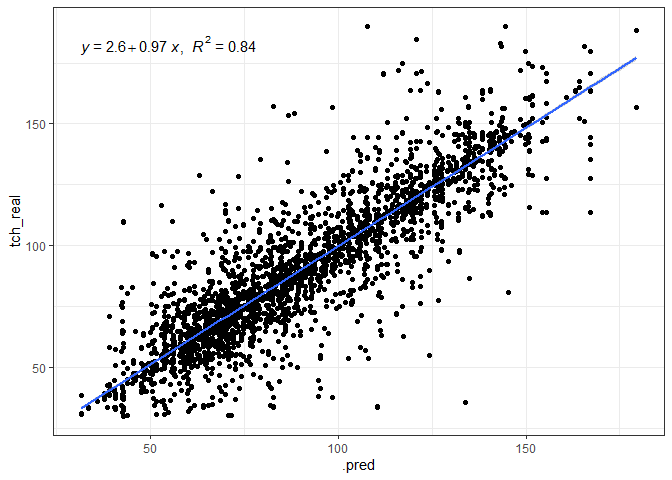
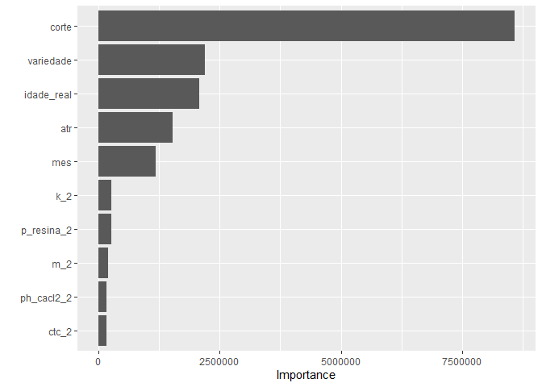
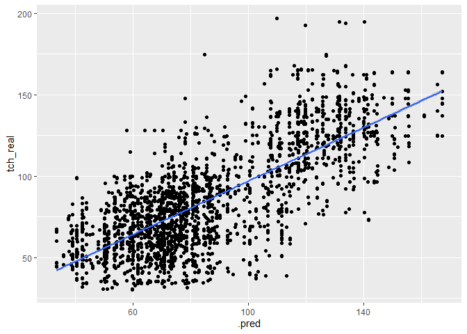
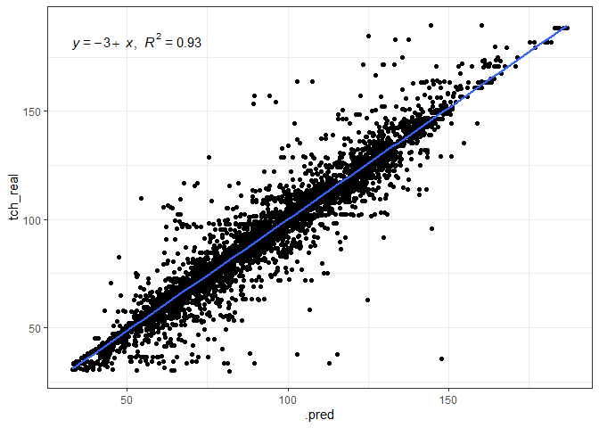
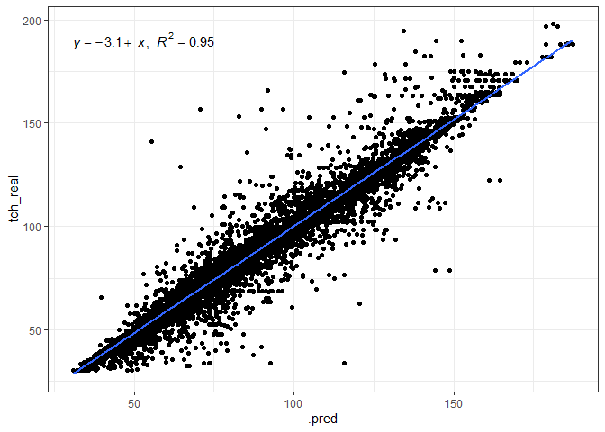
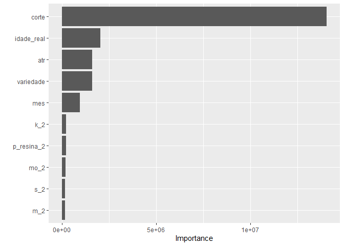
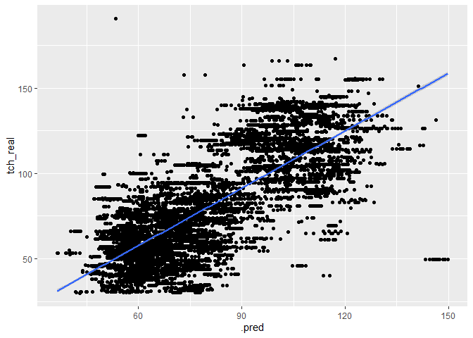

<!-- README.md is generated from README.Rmd. Please edit that file -->

# bigdata-sugarcane

### Carregando os pacotes

``` r
library("tidymodels")

library("tidyverse")
library("agricolae")
library("gclus")
library("cluster")
library("vegan")
library("lattice")
library("nortest")
library("rio")
library("gganimate")
library("corrplot")

library(readxl)
library(tidyverse)
library(geobr)
library(skimr)
library(ISLR)
library(modeldata)
library(vip)
library(ggpubr)
library(rpart.plot)
```

# Análise iniciais, básicas

### Carregando o banco de dados

``` r
data_set <-  readxl::read_xlsx("data/Big_03.xlsx",
                               na = "NA")
glimpse(data_set)
#> Rows: 53,654
#> Columns: 112
#> $ Chave          <dbl> 4412213, 4412213, 4412213, 4412314, 4412314, 4412313, 4…
#> $ FAZENDA        <dbl> 44122, 44122, 44122, 44123, 44123, 44123, 44123, 44123,…
#> $ QUADRA         <dbl> 1, 1, 1, 1, 1, 1, 1, 1, 1, 1, 1, 1, 1, 1, 1, 1, 1, 1, 1…
#> $ TALHAO         <dbl> 3, 3, 3, 4, 4, 3, 4, 2, 7, 2, 7, 11, 4, 5, 11, 7, 4, 2,…
#> $ FAZ_QUADRA     <dbl> 441221, 441221, 441221, 441231, 441231, 441231, 441231,…
#> $ FAZ_TALHAO     <dbl> 441223, 441223, 441223, 441234, 441234, 441233, 441234,…
#> $ UNIDADE        <chr> "CAT", "CAT", "CAT", "CAT", "CAT", "CAT", "CAT", "CAT",…
#> $ ponto          <chr> "CF1659867", "CF1659868", "CF1659869", "CF1659881", "CF…
#> $ X              <dbl> -49.01182, -49.00969, -49.01071, -48.99698, -48.99910, …
#> $ Y              <dbl> -21.57020, -21.56957, -21.56829, -21.56793, -21.56784, …
#> $ DATA           <dttm> 2016-10-27, 2016-10-27, 2016-10-27, 2016-11-22, 2016-1…
#> $ Ph_Cacl2_1     <dbl> 5.00, 4.98, 5.11, 5.52, 6.10, 5.82, 5.74, 5.77, 5.57, 5…
#> $ MO_1           <dbl> 21.2162, 18.8782, 14.4360, 13.3452, 14.2404, 12.6738, 1…
#> $ P_resina_1     <dbl> 9.27646, 8.75594, 7.06425, 10.53918, 10.53918, 10.67452…
#> $ S_1            <dbl> 7.83005, 5.42264, 5.21330, 5.29928, 4.67093, 11.45711, …
#> $ Ca_1           <dbl> 13.952941, 10.964706, 13.435294, 11.517857, 20.000000, …
#> $ Mg_1           <dbl> 5.314685, 6.503497, 6.923077, 4.635821, 11.620896, 6.49…
#> $ K_1            <dbl> 0.9774991, 1.1887667, 0.5687049, 0.6072340, 0.5987234, …
#> $ Al_1           <dbl> 0.480, 0.576, 0.384, 0.576, 0.672, 0.384, 0.480, 0.480,…
#> $ H_Al_1         <dbl> 19.60717, 16.05187, 14.44755, 14.83242, 13.21014, 12.53…
#> $ SB_1           <dbl> 20.24513, 18.65697, 20.92708, 16.76091, 32.21962, 24.03…
#> $ CTC_1          <dbl> 39.85229, 34.70883, 35.37463, 31.59333, 45.42976, 36.57…
#> $ V_1            <dbl> 50.80041, 53.75280, 59.15843, 53.05206, 70.92183, 65.73…
#> $ m_1            <dbl> 2.3160294, 2.9948574, 1.8018799, 3.3223910, 2.0430737, …
#> $ B_1            <dbl> NA, NA, NA, NA, NA, 0.2501072, NA, NA, NA, NA, NA, NA, …
#> $ Cu_1           <dbl> NA, NA, NA, NA, NA, 0.7327344, NA, NA, NA, NA, NA, NA, …
#> $ Fe_1           <dbl> NA, NA, NA, NA, NA, 42.09182, NA, NA, NA, NA, NA, NA, N…
#> $ Mn_1           <dbl> NA, NA, NA, NA, NA, 3.253708, NA, NA, NA, NA, NA, NA, N…
#> $ Zn_1           <dbl> NA, NA, NA, NA, NA, 0.3504326, NA, NA, NA, NA, NA, NA, …
#> $ Estagio        <dbl> 5, 5, 5, 5, 5, 5, 5, 5, 5, 5, 5, 5, 5, 5, 5, 5, 5, 5, 5…
#> $ Estagio_OP     <chr> "Soca", "Soca", "Soca", "Soca", "Soca", "Soca", "Soca",…
#> $ Ph_Cacl2_2     <dbl> 4.53, 5.00, 5.16, 5.71, 6.21, 6.11, 5.87, 5.68, 5.50, 5…
#> $ MO_2           <dbl> 17.0078, 12.5656, 11.3966, 11.1072, 16.4784, 11.7786, 1…
#> $ P_resina_2     <dbl> 7.19438, 6.41360, 6.28347, 12.43394, 11.08054, 10.40384…
#> $ S_2            <dbl> 7.62071, 6.46934, 8.03939, 4.79660, 4.79660, 5.04794, 5…
#> $ Ca_2           <dbl> 8.894118, 11.341176, 12.164706, 12.767857, 18.750000, 1…
#> $ Mg_2           <dbl> 4.973776, 6.354895, 6.232517, 5.282587, 12.536318, 7.19…
#> $ K_2            <dbl> 0.73703195, 0.97062865, 0.23033322, 0.57744681, 0.61148…
#> $ Al_2           <dbl> 2.016, 0.768, 0.288, 0.480, 0.576, 0.576, 0.576, 0.576,…
#> $ H_Al_2         <dbl> 18.02311, 15.71735, 12.73259, 14.83242, 12.14291, 11.52…
#> $ SB_2           <dbl> 14.60493, 18.66670, 18.62756, 18.62789, 31.89781, 24.63…
#> $ CTC_2          <dbl> 32.62804, 34.38405, 31.36015, 33.46031, 44.04071, 36.15…
#> $ V_2            <dbl> 44.76188, 54.28884, 59.39881, 55.67161, 72.42800, 68.13…
#> $ m_2            <dbl> 12.129288, 3.951695, 1.522556, 2.512051, 1.773737, 2.28…
#> $ B_2            <dbl> NA, NA, NA, NA, NA, 0.2696464, NA, NA, NA, NA, NA, NA, …
#> $ Cu_2           <dbl> NA, NA, NA, NA, NA, 0.4576081, NA, NA, NA, NA, NA, NA, …
#> $ Fe_2           <dbl> NA, NA, NA, NA, NA, 31.75250, NA, NA, NA, NA, NA, NA, N…
#> $ Mn_2           <dbl> NA, NA, NA, NA, NA, 2.480874, NA, NA, NA, NA, NA, NA, N…
#> $ Zn_2           <dbl> NA, NA, NA, NA, NA, 0.2906881, NA, NA, NA, NA, NA, NA, …
#> $ Ph_Cacl2_M     <dbl> 4.765, 4.990, 5.135, 5.615, 6.155, 5.965, 5.805, 5.725,…
#> $ MO_Media       <dbl> 19.1120, 15.7219, 12.9163, 12.2262, 15.3594, 12.2262, 1…
#> $ P_Media        <dbl> 8.235420, 7.584770, 6.673860, 11.486560, 10.809860, 10.…
#> $ S_Media        <dbl> 7.725380, 5.945990, 6.626345, 5.047940, 4.733765, 8.252…
#> $ Ca_Media       <dbl> 11.42353, 11.15294, 12.80000, 12.14286, 19.37500, 17.00…
#> $ Mg_Media       <dbl> 5.144231, 6.429196, 6.577797, 4.959204, 12.078607, 6.84…
#> $ K_Media        <dbl> 0.85726554, 1.07969770, 0.39951907, 0.59234043, 0.60510…
#> $ Al_Media       <dbl> 1.248, 0.672, 0.336, 0.528, 0.624, 0.480, 0.528, 0.528,…
#> $ H_Al_Media     <dbl> 18.81514, 15.88461, 13.59007, 14.83242, 12.67653, 12.02…
#> $ SB_Media       <dbl> 17.42503, 18.66183, 19.77732, 17.69440, 32.05871, 24.33…
#> $ CTC_Media      <dbl> 36.24017, 34.54644, 33.36739, 32.52682, 44.73524, 36.36…
#> $ V_Media        <dbl> 47.78114, 54.02082, 59.27862, 54.36183, 71.67491, 66.93…
#> $ m_Media        <dbl> 7.222659, 3.473276, 1.662218, 2.917221, 1.908405, 1.928…
#> $ B_Media        <dbl> NA, NA, NA, NA, NA, 0.2598768, NA, NA, NA, NA, NA, NA, …
#> $ Cu_Media       <dbl> NA, NA, NA, NA, NA, 0.5951713, NA, NA, NA, NA, NA, NA, …
#> $ Fe_Media       <dbl> NA, NA, NA, NA, NA, 36.92216, NA, NA, NA, NA, NA, NA, N…
#> $ Mn_Media       <dbl> NA, NA, NA, NA, NA, 2.867291, NA, NA, NA, NA, NA, NA, N…
#> $ Zn_Media       <dbl> NA, NA, NA, NA, NA, 0.3205604, NA, NA, NA, NA, NA, NA, …
#> $ CP_Cal_OP      <dbl> 3358.0600, 3104.4658, 2655.5507, 3224.4847, 0.0000, 153…
#> $ CP_Rec_V_O     <dbl> 750, 0, 0, 0, 0, 0, 0, 0, 0, 0, 0, 0, 0, 0, 750, 0, 0, …
#> $ CP_Rec_OP      <dbl> 750, 750, 750, 750, 750, 750, 750, 750, 750, 750, 750, …
#> $ Composto       <dbl> 2000, 2000, 2000, 1400, 1400, 1400, 1400, 1400, 1400, 2…
#> $ Agrofos        <dbl> 1100, 1100, 1100, 750, 750, 750, 750, 750, 750, 1100, 7…
#> $ CS_Cal_OP      <dbl> 1341.5467, 1566.4747, 1205.2036, 1730.7902, 0.0000, 795…
#> $ CS_Rec_OP      <dbl> 750, 750, 750, 750, 750, 750, 750, 750, 750, 750, 750, …
#> $ CS_Rec_V_O     <dbl> 750, 0, 0, 0, 0, 0, 0, 0, 0, 0, 0, 0, 0, 0, 750, 0, 0, …
#> $ Fosfato        <lgl> NA, NA, NA, NA, NA, NA, NA, NA, NA, NA, NA, NA, NA, NA,…
#> $ ANO            <dbl> 2016, 2016, 2016, 2016, 2016, 2016, 2016, 2016, 2016, 2…
#> $ chave          <dbl> 4412213, 4412213, 4412213, 4412314, 4412314, 4412313, 4…
#> $ unidade        <chr> "CAT", "CAT", "CAT", "CAT", "CAT", "CAT", "CAT", "CAT",…
#> $ ano            <dbl> 2016, 2016, 2016, 2016, 2016, 2016, 2016, 2016, 2016, 2…
#> $ mes            <dbl> 10, 10, 10, 10, 10, 10, 10, 10, 10, 10, 10, 10, 10, 10,…
#> $ fazenda        <dbl> 44122, 44122, 44122, 44123, 44123, 44123, 44123, 44123,…
#> $ quadra         <dbl> 1, 1, 1, 1, 1, 1, 1, 1, 1, 1, 1, 1, 1, 1, 1, 1, 1, 1, 1…
#> $ talhao         <dbl> 3, 3, 3, 4, 4, 3, 4, 2, 7, 2, 7, 11, 4, 5, 11, 7, 4, 2,…
#> $ area_ha        <dbl> 9.54, 9.54, 9.54, 13.55, 13.55, 5.65, 13.55, 2.04, 15.1…
#> $ variedade      <chr> "SP81-3250", "SP81-3250", "SP81-3250", "SP86-155", "SP8…
#> $ corte          <chr> "5ºC", "5ºC", "5ºC", "5ºC", "5ºC", "5ºC", "5ºC", "5ºC",…
#> $ distancia      <dbl> 85, 85, 85, 84, 84, 84, 84, 84, 84, 85, 84, 84, 84, 84,…
#> $ idade_obje     <dbl> 7.0, 7.0, 7.0, 6.8, 6.8, 6.8, 6.8, 6.8, 6.8, 7.0, 6.8, …
#> $ tch_objeti     <dbl> 50, 50, 50, 66, 66, 66, 66, 66, 66, 50, 66, 66, 66, 66,…
#> $ tc_objetiv     <dbl> 477.00, 477.00, 477.00, 894.30, 894.30, 372.90, 894.30,…
#> $ porcent_ob     <dbl> 0.07, 0.07, 0.07, 0.13, 0.13, 0.05, 0.13, 0.02, 0.14, 0…
#> $ idade_real     <dbl> 13.3, 13.3, 13.3, 13.2, 13.2, 13.2, 13.2, 13.2, 13.2, 1…
#> $ tch_real       <dbl> 51.13, 51.13, 51.13, 49.76, 49.76, 49.78, 49.76, 49.87,…
#> $ tc_real        <dbl> 487.75, 487.75, 487.75, 674.21, 674.21, 281.25, 674.21,…
#> $ porcent_re     <dbl> 0.08, 0.08, 0.08, 0.11, 0.11, 0.04, 0.11, 0.02, 0.12, 0…
#> $ variacao_p     <dbl> 2.25, 2.25, 2.25, -24.61, -24.61, -24.58, -24.61, -24.4…
#> $ variacao_t     <dbl> 10.75, 10.75, 10.75, -220.09, -220.09, -91.65, -220.09,…
#> $ aplic_vinh     <chr> "NAO", "NAO", "NAO", "NAO", "NAO", "NAO", "NAO", "NAO",…
#> $ consumo_to     <dbl> 0, 0, 0, 0, 0, 0, 0, 0, 0, 0, 0, 0, 0, 0, 0, 0, 0, 0, 0…
#> $ consumo_me     <dbl> 0, 0, 0, 0, 0, 0, 0, 0, 0, 0, 0, 0, 0, 0, 0, 0, 0, 0, 0…
#> $ data_vinha     <dbl> NA, NA, NA, NA, NA, NA, NA, NA, NA, NA, NA, NA, NA, NA,…
#> $ atr            <dbl> 150.57, 150.57, 150.57, 148.36, 148.36, 148.36, 148.36,…
#> $ tch_idade_real <dbl> 3.844361, 3.844361, 3.844361, 3.769697, 3.769697, 3.771…
#> $ solos          <chr> "LVd md", "LVd md", "LVd md", "LVPd md/md-arg", "LVPd m…
#> $ manejo         <chr> "LVd + al md", "LVd + al md", "LVd + al md", "LVPd + al…
#> $ ambiente       <chr> "D", "D", "D", "C", "C", "C", "C", "C", "C", "C", "C", …
#> $ textura_1      <chr> "Media", "Media", "Media", "Media", "Media", "Media", "…
#> $ textura_2      <chr> "Media", "Media", "Media", "Media-Argilosa", "Media-Arg…
#> $ nematoide      <chr> NA, NA, NA, NA, NA, NA, NA, NA, NA, NA, NA, NA, NA, NA,…
#> $ migdolus       <chr> "Ausente", "Ausente", "Ausente", "Ausente", "Ausente", …
#> $ sphenophorus   <chr> NA, NA, NA, NA, NA, NA, NA, NA, NA, NA, NA, NA, NA, NA,…
```

## Preparando o banco de dados

``` r
data_set[25795,names(data_set)=="B_2"] <- NA
data_set[6,names(data_set)=="B_2"]
#> # A tibble: 1 × 1
#>     B_2
#>   <dbl>
#> 1 0.270
data_set$B_2<-as.numeric(as.character(data_set$B_2))
```

``` r
data_set[18854,names(data_set)=="Cu_1"| names(data_set)=="Fe_1" | names(data_set)=="Mn_1" | names(data_set)=="Zn_1"]<-NA
data_set[27272,names(data_set)=="Cu_1"| names(data_set)=="Fe_1" | names(data_set)=="Mn_1" | names(data_set)=="Zn_1"]<-NA
data_set$Cu_1<-as.numeric(as.character(data_set$Cu_1))
data_set$Fe_1<-as.numeric(as.character(data_set$Fe_1))
data_set$Mn_1<-as.numeric(as.character(data_set$Mn_1))
data_set$Zn_1<-as.numeric(as.character(data_set$Zn_1))

UN<-as.character(data_set$UNIDADE)
un<-as.character(data_set$unidade)
UN[is.na(data_set$UNIDADE)]<-un[is.na(data_set$UNIDADE)]
data_set$UNIDADE<-factor(UN)

apv<-as.character(data_set$aplic_vinh)
apv[apv=="Sim"]<-"SIM"
data_set$aplic_vinh<-as.factor(apv)

vari<-sub(" ","",data_set$variedade)
vari<-sub("-","",vari)
vari<-sub("VIVEIRO","Viveiro",vari)
data_set$variedade<-as.factor(vari)

cort<-sub("15M","15m",data_set$corte)
data_set$corte<-as.factor(cort)
```

``` r
#Construindo o vetor numérico referente ao número de cortes
CORTE<-1:length(data_set[,1])
{CORTE[data_set$corte =="10ºC"] =10
CORTE[data_set$corte =="11ºC"] =11
CORTE[data_set$corte =="12m" ] =1
CORTE[data_set$corte =="12mB"] =1.5
CORTE[data_set$corte =="12mT"] =1.75
CORTE[data_set$corte =="15m" ]=1
CORTE[data_set$corte =="15mB" ]=1.5
CORTE[data_set$corte =="18m" ]=1.5
CORTE[data_set$corte =="18mB"] =1.5
CORTE[data_set$corte =="2ºC" ]=2
CORTE[data_set$corte =="2ºCB"] =2.5
CORTE[data_set$corte =="2ºCT"] =2.75
CORTE[data_set$corte =="3ºC"  ]=3
CORTE[data_set$corte =="3ºCB" ]=3.5
CORTE[data_set$corte =="4ºC"  ]=4
CORTE[data_set$corte =="4ºCB" ]=4.5
CORTE[data_set$corte =="5ºC"  ]=5
CORTE[data_set$corte =="5ºCB" ]=5.5
CORTE[data_set$corte =="6ºC"  ]=6
CORTE[data_set$corte =="6ºCB" ]=6.5
CORTE[data_set$corte =="7ºC" ]=7
CORTE[data_set$corte =="7ºCB" ]=7.5
CORTE[data_set$corte =="8ºC"  ]=8
CORTE[data_set$corte =="8ºCB" ]=8.5
CORTE[data_set$corte =="9ºC" ]=9
CORTE[data_set$corte =="9ºCB"] =9.5
CORTE[data_set$corte =="REF" ]=0}
```

``` r
data_set <- data_set %>% 
  janitor::clean_names()
```

## Análise por pontos coincidentes

``` r
# xy<-paste(data_set$X,data_set$Y,sep="") # vetor de caracter único para cada xy
# txy<-table(xy,data_set$ano)# Criamos a tabela de frência para cada coordenada
# fxy<-apply(txy[,1:3],1,sum)==3#filtro somente as coordenadas com a soma igual a 3
# lcoo3<-row.names(txy)[fxy]#Lista das coordenadas que apareceran nos três anos
# length(xy)
# length(lcoo3)
# ff<-vector()
# for( i in 1:length(lcoo3)){
#   f<-which(xy==lcoo3[i])
#   if(sum(data_set$ano[f]==c(2016,2017,2018))==3)  ff<-c(ff,f)
# }
# data_set$CORTE<-CORTE
# dc<-data_set[ff,]
# xyplot(X~Y| factor(ano),data=dc)

# Filtro das variáveis
# names(dc)
top_variedades <- data_set %>% 
  group_by(variedade) %>% 
  summarise(
    n=n()
  ) %>% arrange(desc(n)) %>% 
  head(12) %>% 
  pull(variedade) %>% as.character()

dc <- data_set %>% 
  select(tch_real,atr,corte,variedade,mes,ca_2,m_2,sb_2,idade_real,
              ctc_2,p_resina_2,h_al_2,v_2,k_2,mg_2,mo_2,ph_cacl2_2,s_2,ano) %>%   mutate(
    variedade = forcats::fct_other(variedade, keep = top_variedades, other_level = "outro")) 

# Separar o banco de dados por ano
data_set16<-dc %>% filter(ano==2016) %>% drop_na() %>% select(-ano)
data_set17<-dc %>% filter(ano==2017) %>% drop_na() %>% select(-ano)
data_set18<-dc %>% filter(ano==2018) %>% drop_na() %>% select(-ano)

# length(data_set16[,1]);length(data_set17[,1]);length(data_set18[,1]) # todos com o mesmo número de observações
# dC<-data_set[-ff,]
# length(data_set[,1]) == length(dc[,1]) + length(dC[,1])
# 
# bd<-data_set17
# names(bd)
```

``` r
visdat::vis_miss(data_set16)
```

<!-- -->

``` r
visdat::vis_miss(data_set17)
```

<!-- -->

``` r
visdat::vis_miss(data_set18)
```

<!-- -->

# 2016 par aprevisão de 2017

``` r
data_set_ml <- data_set16
tch_initial_split <- initial_split(data_set_ml, prop = 0.70)
```

``` r
tch_train <- training(tch_initial_split)
tch_train  %>% 
  ggplot(aes(x=tch_real, y=..density..))+
  geom_histogram(bins = 30, color="black",  fill="lightgray")+
  geom_density(alpha=.05,fill="red")+
  theme_bw() +
  labs(x="tch", y = "Densidade")
```

<!-- -->

``` r
tch_recipe <- recipe(tch_real ~ ., data = tch_train ) %>%  
  step_normalize(all_numeric_predictors())  %>% 
  #step_novel(all_nominal_predictors()) %>% 
  step_zv(all_predictors())  #%>%
  #step_naomit(c(Ts, Us)) %>% 
  #step_impute_mean(c(Us,Ts)) %>% 
  #step_poly(c(ms,ts), degree = 5)  
  #step_dummy(all_nominal_predictors())
bake(prep(tch_recipe), new_data = NULL)
#> # A tibble: 14,842 × 18
#>         atr corte variedade    mes    ca_2     m_2    sb_2 idade_real    ctc_2
#>       <dbl> <fct> <fct>      <dbl>   <dbl>   <dbl>   <dbl>      <dbl>    <dbl>
#>  1  0.719   3ºC   RB92579   -0.633 -0.595  -0.294  -0.743     -1.39   -0.915  
#>  2  0.651   2ºC   CV7870     1.15  -0.477   0.524  -0.288     -1.04   -0.231  
#>  3  0.690   15m   RB966928  -1.08  -0.0370 -0.531  -0.0760    -0.369  -0.00567
#>  4  0.00527 18m   CV7870    -0.633 -0.210  -0.442   0.235      0.509  -0.330  
#>  5 -0.709   4ºCB  RB867515  -1.97  -1.09    1.09   -1.27       0.720  -0.851  
#>  6  0.585   18m   CTC4       0.256  0.583  -0.639   0.367      0.474   0.337  
#>  7  1.05    15m   CTC4      -0.188 -0.159  -0.368  -0.0702     2.93   -0.283  
#>  8  0.558   5ºC   RB867515   1.59  -0.533   0.0662 -0.275      0.509  -0.384  
#>  9 -0.471   3ºC   RB966928   0.256 -0.354  -0.152  -0.604      0.0172 -0.631  
#> 10  0.0526  18m   RB92579   -1.52  -0.544  -0.232  -0.229     -0.615  -0.427  
#> # ℹ 14,832 more rows
#> # ℹ 9 more variables: p_resina_2 <dbl>, h_al_2 <dbl>, v_2 <dbl>, k_2 <dbl>,
#> #   mg_2 <dbl>, mo_2 <dbl>, ph_cacl2_2 <dbl>, s_2 <dbl>, tch_real <dbl>
```

``` r
tch_resamples <- vfold_cv(tch_train, v = 5)
grid <- grid_regular(
  penalty(range = c(-10, -2)),
  levels = 5
)
```

## Modelo Decision Tree

``` r
tch_dt_model <- decision_tree(
  cost_complexity = tune(),
  tree_depth = tune(),
  min_n = tune()
)  %>%  
  set_mode("regression")  %>%  
  set_engine("rpart")
```

``` r
tch_dt_recipe <- tch_recipe

tch_dt_wf <- workflow()   %>%  
  add_model(tch_dt_model) %>% 
  add_recipe(tch_dt_recipe)

grid_dt <- grid_random(
  cost_complexity(c(-20, -1)),
  tree_depth(range = c(2, 30)),
  min_n(range = c(2, 60)),
  size = 2
)
```

``` r
tch_dt_tune_grid <- tune_grid(
  tch_dt_wf,
  resamples = tch_resamples,
  grid = grid_dt,
  metrics = metric_set(rmse)
)
autoplot(tch_dt_tune_grid)
```

<!-- -->

``` r
collect_metrics(tch_dt_tune_grid)
#> # A tibble: 2 × 9
#>   cost_complexity tree_depth min_n .metric .estimator  mean     n std_err
#>             <dbl>      <int> <int> <chr>   <chr>      <dbl> <int>   <dbl>
#> 1        3.90e-20         29    41 rmse    standard    13.0     5  0.188 
#> 2        3.74e- 3         15    25 rmse    standard    17.7     5  0.0630
#> # ℹ 1 more variable: .config <chr>

tch_dt_best_params <- select_best(tch_dt_tune_grid, "rmse")
tch_dt_wf <- tch_dt_wf %>% finalize_workflow(tch_dt_best_params)
tch_dt_last_fit <- last_fit(tch_dt_wf, tch_initial_split)

tch_test_preds <- bind_rows(
  collect_predictions(tch_dt_last_fit)  %>%   mutate(modelo = "dt")
)

tch_test <- testing(tch_initial_split)

tch_test_preds %>% 
  ggplot(aes(x=.pred, y=tch_real)) +
  geom_point()+
  theme_bw() +
  geom_smooth(method = "lm") +
  stat_regline_equation(ggplot2::aes(
  label =  paste(..eq.label.., ..rr.label.., sep = "*plain(\",\")~~"))) 
```

<!-- -->

``` r
tch_dt_last_fit_model <- tch_dt_last_fit$.workflow[[1]]$fit$fit
vip(tch_dt_last_fit_model)
```

<!-- -->

``` r
final_wf <- tch_dt_last_fit %>%
  extract_workflow()
final_wf
#> ══ Workflow [trained] ══════════════════════════════════════════════════════════
#> Preprocessor: Recipe
#> Model: decision_tree()
#> 
#> ── Preprocessor ────────────────────────────────────────────────────────────────
#> 2 Recipe Steps
#> 
#> • step_normalize()
#> • step_zv()
#> 
#> ── Model ───────────────────────────────────────────────────────────────────────
#> n= 14842 
#> 
#> node), split, n, deviance, yval
#>       * denotes terminal node
#> 
#>      1) root 14842 1.389678e+07  91.60089  
#>        2) corte=12m,2ºC,2ºCB,3ºC,3ºCB,4ºC,4ºCB,5ºC,5ºCB,6ºC,6ºCB,7ºC,7ºCB,8ºC,9ºC,9ºCB 11610 6.571135e+06  80.88283  
#>          4) corte=3ºC,4ºC,5ºC,6ºC,6ºCB,7ºC,7ºCB,8ºC,9ºC,9ºCB 7897 3.271648e+06  72.87062  
#>            8) variedade=CV7231,IACSP9550,RB855453,RB855536,RB867515,RB92579,RB965902,SP813250,outro 5209 1.887918e+06  67.48501  
#>             16) corte=4ºC,5ºC,6ºC,7ºCB,9ºCB 2677 6.698301e+05  61.07122  
#>               32) mes>=0.9230668 1243 2.884677e+05  55.28681  
#>                 64) idade_real< -0.1408882 814 1.242554e+05  51.19611  
#>                  128) idade_real< -0.7031433 154 2.768417e+04  44.27870  
#>                    256) atr>=0.9605127 79 4.648195e+03  37.44013  
#>                      512) atr< 1.364978 45 4.786978e-01  33.46578  
#>                       1024) ctc_2< -0.1685552 14 3.542929e-01  33.41071 *
#>                       1025) ctc_2>=-0.1685552 31 6.278710e-02  33.49065 *
#>                      513) atr>=1.364978 34 2.996163e+03  42.70029 *
#>                    257) atr< 0.9605127 75 1.544989e+04  51.48200  
#>                      514) atr< 0.02004553 59 7.326524e+03  46.23288  
#>                       1028) idade_real< -0.878848 15 5.254736e+01  31.51400 *
#>                       1029) idade_real>=-0.878848 44 2.916449e+03  51.25068  
#>                         2058) ctc_2>=-0.2392575 27 3.809474e+02  48.00296 *
#>                         2059) ctc_2< -0.2392575 17 1.798405e+03  56.40882 *
#>                      515) atr>=0.02004553 16 5.031720e+02  70.83813 *
#>                  129) idade_real>=-0.7031433 660 8.748286e+04  52.81017  
#>                    258) corte=5ºC 253 2.269675e+04  47.24743  
#>                      516) idade_real< -0.3165929 137 4.649126e+03  42.24650  
#>                       1032) atr>=0.04861918 105 1.514555e+03  39.74971  
#>                         2064) atr< 0.4570253 56 1.307918e+02  37.44875  
#>                           4128) mes>=1.367545 27 1.503474e+00  35.87519 *
#>                           4129) mes< 1.367545 29 1.892828e-01  38.91379 *
#>                         2065) atr>=0.4570253 49 7.484309e+02  42.37939  
#>                           4130) idade_real< -0.3868748 22 4.682991e+01  39.08364 *
#>                           4131) idade_real>=-0.3868748 27 2.679265e+02  45.06481 *
#>                       1033) atr< 0.04861918 32 3.322291e+02  50.43906 *
#>                      517) idade_real>=-0.3165929 116 1.057479e+04  53.15371  
#>                       1034) variedade=RB855453,RB855536,RB867515,RB965902,SP813250 57 3.373128e+03  47.75035  
#>                         2068) variedade=RB855453,RB855536,RB965902 26 5.356958e+01  43.88077 *
#>                         2069) variedade=RB867515,SP813250 31 2.603721e+03  50.99581 *
#>                       1035) variedade=RB92579,outro 59 3.929700e+03  58.37390  
#>                         2070) atr>=1.361036 31 2.207906e+02  51.48419 *
#>                         2071) atr< 1.361036 28 6.082302e+02  66.00179 *
#>                    259) corte=4ºC,6ºC 407 5.209069e+04  56.26808  
#>                      518) v_2< 0.3668982 240 1.549162e+04  51.94600  
#>                       1036) variedade=IACSP9550,RB855536,outro 106 6.107496e+03  48.52481  
#>                         2072) mes>=1.367545 52 3.156849e+03  44.69904  
#>                           4144) p_resina_2< -0.1486409 17 1.006551e+03  39.06529 *
#>                           4145) p_resina_2>=-0.1486409 35 1.348660e+03  47.43543 *
#>                         2073) mes< 1.367545 54 1.456636e+03  52.20889  
#> 
#> ...
#> and 1170 more lines.


pred <- predict(final_wf, data_set17)
obs <- data_set17 %>% select(tch_real)
cbind(pred, obs) %>% #filter(.pred <=3.75) %>% 
  ggplot(aes(x=.pred, y=tch_real)) +
  geom_point()  +
  geom_smooth(method = "lm")
```

<!-- -->

``` r

y_pre <- pred$.pred
y_obs <- obs$tch_real
reg <- lm(y_obs ~ y_pre)
plot(y_pre,y_obs,pch=21,bg="gray",
     ylab="observado",main=paste("2017"),
     xlab="predito")
abline(reg)
abline(0,1,col="blue",lty=2)
R2<-summary(reg)$r.squared;R2
#> [1] 0.5878226
R<-sqrt(R2);R
#> [1] 0.7666959
RMSE<-caret::RMSE(y_obs,y_pre);RMSE
#> [1] 20.71787
MAE<-caret::MAE(y_obs,y_pre);MAE
#> [1] 16.27431
text(55,150,paste("R2=",round(R2,3),"\nR=",round(R,3),
               "\nRSME=",round(RMSE,3),"\nMAE=",round(MAE,3)))
```

<!-- -->

## Modelo Random Forest

``` r
tch_rf_model <- rand_forest(
  min_n = tune(),
  mtry = tune(),
  trees = tune()
)   %>%  
  set_mode("regression")  %>% 
  set_engine("randomForest")
```

``` r
tch_rf_wf <- workflow()   %>%  
  add_model(tch_rf_model) %>%  
  add_recipe(tch_recipe)
```

``` r
grid_rf <- grid_random(
  min_n(range = c(2, 7)),
  mtry(range = c(20,30)),
  trees(range = c(50,70)),
  size = 2
)
```

``` r
tch_rf_tune_grid <- tune_grid(
 tch_rf_wf,
  resamples = tch_resamples,
  grid = grid_rf,
  metrics = metric_set(rmse)
) 

autoplot(tch_rf_tune_grid)
```

<!-- -->

``` r
tch_rf_best_params <- select_best(tch_rf_tune_grid, "rmse")
tch_rf_wf <- tch_rf_wf %>% finalize_workflow(tch_rf_best_params)
tch_rf_last_fit <- last_fit(tch_rf_wf, tch_initial_split)

tch_test_preds <- bind_rows(
  collect_predictions(tch_rf_last_fit)  %>%   mutate(modelo = "rf")
)
```

``` r
tch_test <- testing(tch_initial_split)

tch_test_preds %>% 
  ggplot(aes(x=.pred, y=tch_real)) +
  geom_point()+
  theme_bw() +
  geom_smooth(method = "lm") +
  stat_regline_equation(ggplot2::aes(
  label =  paste(..eq.label.., ..rr.label.., sep = "*plain(\",\")~~"))) 
```

<!-- -->

``` r
tch_rf_last_fit_model <- tch_rf_last_fit$.workflow[[1]]$fit$fit
vip(tch_rf_last_fit_model)
```

<!-- -->

``` r
final_wf <- tch_rf_last_fit %>%
  extract_workflow()
final_wf
#> ══ Workflow [trained] ══════════════════════════════════════════════════════════
#> Preprocessor: Recipe
#> Model: rand_forest()
#> 
#> ── Preprocessor ────────────────────────────────────────────────────────────────
#> 2 Recipe Steps
#> 
#> • step_normalize()
#> • step_zv()
#> 
#> ── Model ───────────────────────────────────────────────────────────────────────
#> 
#> Call:
#>  randomForest(x = maybe_data_frame(x), y = y, ntree = ~50L, mtry = min_cols(~20L,      x), nodesize = min_rows(~6L, x)) 
#>                Type of random forest: regression
#>                      Number of trees: 50
#> No. of variables tried at each split: 17
#> 
#>           Mean of squared residuals: 70.05778
#>                     % Var explained: 92.52


pred <- predict(final_wf, data_set17)
obs <- data_set17 %>% select(tch_real)
cbind(pred, obs) %>% #filter(.pred <=3.75) %>% 
  ggplot(aes(x=.pred, y=tch_real)) +
  geom_point()  +
  geom_smooth(method = "lm")
```

<!-- -->

``` r

y_pre <- pred$.pred
y_obs <- obs$tch_real
reg <- lm(y_obs ~ y_pre)
plot(y_pre,y_obs,pch=21,bg="gray",
     ylab="observado",main=paste("2017"),
     xlab="predito")
abline(reg)
abline(0,1,col="blue",lty=2)
R2<-summary(reg)$r.squared;R2
#> [1] 0.6660286
R<-sqrt(R2);R
#> [1] 0.8161058
RMSE<-caret::RMSE(y_obs,y_pre);RMSE
#> [1] 18.17812
MAE<-caret::MAE(y_obs,y_pre);MAE
#> [1] 14.08655
text(55,150,paste("R2=",round(R2,3),"\nR=",round(R,3),
               "\nRSME=",round(RMSE,3),"\nMAE=",round(MAE,3)))
```

<!-- -->

# 2016 + 2017 para previsão de 2018

# 2016 par aprevisão de 2017

``` r
data_set_ml <- rbind(data_set16, data_set17)
tch_initial_split <- initial_split(data_set_ml, prop = 0.70)
```

``` r
tch_train <- training(tch_initial_split)
tch_train  %>% 
  ggplot(aes(x=tch_real, y=..density..))+
  geom_histogram(bins = 30, color="black",  fill="lightgray")+
  geom_density(alpha=.05,fill="red")+
  theme_bw() +
  labs(x="tch", y = "Densidade")
```

<!-- -->

``` r
tch_recipe <- recipe(tch_real ~ ., data = tch_train ) %>%  
  step_normalize(all_numeric_predictors())  %>% 
  #step_novel(all_nominal_predictors()) %>% 
  step_zv(all_predictors())  #%>%
  #step_naomit(c(Ts, Us)) %>% 
  #step_impute_mean(c(Us,Ts)) %>% 
  #step_poly(c(ms,ts), degree = 5)  
  #step_dummy(all_nominal_predictors())
bake(prep(tch_recipe), new_data = NULL)
#> # A tibble: 23,072 × 18
#>        atr corte variedade    mes    ca_2     m_2    sb_2 idade_real   ctc_2
#>      <dbl> <fct> <fct>      <dbl>   <dbl>   <dbl>   <dbl>      <dbl>   <dbl>
#>  1 -0.856  18m   CTC4      -1.09   0.0333  0.534  -0.0988    -0.0362  0.623 
#>  2  0.593  18m   CV7870    -0.642 -0.715   1.93   -0.848      0.0371  0.434 
#>  3 -0.472  15m   RB92579   -0.642 -0.861  -0.239  -1.08      -0.476  -1.55  
#>  4  0.771  3ºC   RB966928  -0.192  0.0311 -0.593   0.0750    -0.403  -0.340 
#>  5  0.472  18m   RB92579   -0.642 -0.0808  0.463  -0.0332     1.28    0.0937
#>  6 -0.828  3ºC   outro     -0.192 -0.183  -0.588  -0.231      0.147  -0.564 
#>  7 -0.657  3ºC   RB867515   0.257 -0.146  -0.518  -0.175      0.110  -0.553 
#>  8 -1.02   18m   RB966928  -1.09  -0.414   0.374  -0.650     -0.109  -0.539 
#>  9  0.0418 3ºC   RB966928  -1.09  -0.141  -0.281  -0.446     -0.769  -0.720 
#> 10 -0.0415 3ºC   IACSP9550  1.61   1.61   -0.0190  1.60       0.220   2.03  
#> # ℹ 23,062 more rows
#> # ℹ 9 more variables: p_resina_2 <dbl>, h_al_2 <dbl>, v_2 <dbl>, k_2 <dbl>,
#> #   mg_2 <dbl>, mo_2 <dbl>, ph_cacl2_2 <dbl>, s_2 <dbl>, tch_real <dbl>
```

``` r
tch_resamples <- vfold_cv(tch_train, v = 5)
grid <- grid_regular(
  penalty(range = c(-10, -2)),
  levels = 5
)
```

## Modelo Decision Tree

``` r
tch_dt_model <- decision_tree(
  cost_complexity = tune(),
  tree_depth = tune(),
  min_n = tune()
)  %>%  
  set_mode("regression")  %>%  
  set_engine("rpart")
```

``` r
tch_dt_recipe <- tch_recipe

tch_dt_wf <- workflow()   %>%  
  add_model(tch_dt_model) %>% 
  add_recipe(tch_dt_recipe)

grid_dt <- grid_random(
  cost_complexity(c(-20, -1)),
  tree_depth(range = c(2, 30)),
  min_n(range = c(2, 60)),
  size = 2
)
```

``` r
tch_dt_tune_grid <- tune_grid(
  tch_dt_wf,
  resamples = tch_resamples,
  grid = grid_dt,
  metrics = metric_set(rmse)
)
autoplot(tch_dt_tune_grid)
```

<!-- -->

``` r
collect_metrics(tch_dt_tune_grid)
#> # A tibble: 2 × 9
#>   cost_complexity tree_depth min_n .metric .estimator  mean     n std_err
#>             <dbl>      <int> <int> <chr>   <chr>      <dbl> <int>   <dbl>
#> 1        3.91e-12         24    49 rmse    standard    12.4     5   0.169
#> 2        2.48e-20         28    42 rmse    standard    12.1     5   0.164
#> # ℹ 1 more variable: .config <chr>

tch_dt_best_params <- select_best(tch_dt_tune_grid, "rmse")
tch_dt_wf <- tch_dt_wf %>% finalize_workflow(tch_dt_best_params)
tch_dt_last_fit <- last_fit(tch_dt_wf, tch_initial_split)

tch_test_preds <- bind_rows(
  collect_predictions(tch_dt_last_fit)  %>%   mutate(modelo = "dt")
)

tch_test <- testing(tch_initial_split)

tch_test_preds %>% 
  ggplot(aes(x=.pred, y=tch_real)) +
  geom_point()+
  theme_bw() +
  geom_smooth(method = "lm") +
  stat_regline_equation(ggplot2::aes(
  label =  paste(..eq.label.., ..rr.label.., sep = "*plain(\",\")~~"))) 
```

<!-- -->

``` r
tch_dt_last_fit_model <- tch_dt_last_fit$.workflow[[1]]$fit$fit
vip(tch_dt_last_fit_model)
```

<!-- -->

``` r
final_wf <- tch_dt_last_fit %>%
  extract_workflow()
final_wf
#> ══ Workflow [trained] ══════════════════════════════════════════════════════════
#> Preprocessor: Recipe
#> Model: decision_tree()
#> 
#> ── Preprocessor ────────────────────────────────────────────────────────────────
#> 2 Recipe Steps
#> 
#> • step_normalize()
#> • step_zv()
#> 
#> ── Model ───────────────────────────────────────────────────────────────────────
#> n= 23072 
#> 
#> node), split, n, deviance, yval
#>       * denotes terminal node
#> 
#>        1) root 23072 2.203014e+07  88.77011  
#>          2) corte=10ºC,2ºCB,2ºCT,3ºC,4ºC,4ºCB,5ºC,6ºC,6ºCB,7ºC,7ºCB,8ºC,9ºC,9ºCB,REF 14194 5.572780e+06  71.49518  
#>            4) corte=10ºC,2ºCT,4ºC,5ºC,6ºC,7ºC,7ºCB,8ºC,9ºC,9ºCB,REF 7472 2.323010e+06  65.33092  
#>              8) variedade=CV7231,CV7870,IACSP9550,RB855453,RB855536,RB867515,RB92579,RB965902,RB975201,SP813250,outro 5261 1.324068e+06  61.13691  
#>               16) mes>=0.9320124 2168 4.809573e+05  55.66677  
#>                 32) idade_real< -0.0178703 1365 2.075915e+05  52.21314  
#>                   64) variedade=IACSP9550,RB855453,RB855536,RB867515,RB92579,RB965902,SP813250,outro 1309 1.897753e+05  51.57532  
#>                    128) corte=5ºC,8ºC,REF 587 7.128477e+04  48.86182  
#>                      256) variedade=RB855453,SP813250 134 7.250400e+03  40.22336  
#>                        512) atr>=0.07620203 108 2.462690e+03  37.83778  
#>                         1024) mes>=1.381789 50 4.622292e+02  33.99100  
#>                           2048) atr>=0.6262218 33 6.611967e+01  31.97909 *
#>                           2049) atr< 0.6262218 17 3.236988e+00  37.89647 *
#>                         1025) mes< 1.381789 58 6.227436e+02  41.15397  
#>                           2050) idade_real< -0.3659758 33 4.478282e+01  38.70485 *
#>                           2051) idade_real>=-0.3659758 25 1.187405e+02  44.38680 *
#>                        513) atr< 0.07620203 26 1.620015e+03  50.13269 *
#>                      257) variedade=IACSP9550,RB855536,RB867515,RB92579,RB965902,outro 453 5.107698e+04  51.41713  
#>                        514) p_resina_2>=0.171323 92 5.710704e+03  45.59804  
#>                         1028) variedade=RB855536,RB92579 23 1.150143e+03  40.17348 *
#>                         1029) variedade=IACSP9550,RB867515,RB965902,outro 69 3.658167e+03  47.40623  
#>                           2058) atr>=1.061493 48 2.275773e+03  45.49104  
#>                             4116) atr< 1.15978 14 7.292857e-03  38.50071 *
#>                             4117) atr>=1.15978 34 1.309970e+03  48.36941 *
#>                           2059) atr< 1.061493 21 8.039055e+02  51.78381 *
#>                        515) p_resina_2< 0.171323 361 4.145707e+04  52.90011  
#>                         1030) atr>=-0.2230165 322 3.687294e+04  51.96696  
#>                           2060) mes>=1.381789 60 9.804555e+03  44.64483  
#>                             4120) variedade=RB867515,RB92579,RB965902 42 1.537488e+03  41.13786  
#>                               8240) ca_2< -0.4805016 20 2.633185e+02  36.82600 *
#>                               8241) ca_2>=-0.4805016 22 5.642892e+02  45.05773 *
#>                             4121) variedade=RB855536,outro 18 6.545224e+03  52.82778 *
#>                           2061) mes< 1.381789 262 2.311490e+04  53.64378  
#>                             4122) idade_real< -0.7140813 14 5.834852e+02  41.59857 *
#>                             4123) idade_real>=-0.7140813 248 2.038553e+04  54.32375  
#>                               8246) variedade=IACSP9550,RB855536,RB92579,outro 160 7.105522e+03  51.77050  
#>                                16492) h_al_2< 0.7167654 113 3.395385e+03  50.01416  
#>                                  32984) idade_real< -0.6041533 29 1.470350e+03  45.51069 *
#>                                  32985) idade_real>=-0.6041533 84 1.133825e+03  51.56893  
#>                                    65970) m_2>=-0.5642497 69 7.225279e+02  50.77536  
#>                                     131940) idade_real>=-0.3842972 38 1.712995e+02  49.20605 *
#>                                     131941) idade_real< -0.3842972 31 3.429289e+02  52.69903 *
#>                                    65971) m_2< -0.5642497 15 1.679627e+02  55.21933 *
#>                                16493) h_al_2>=0.7167654 47 2.523500e+03  55.99319  
#>                                  32986) k_2< -0.4763844 15 1.684748e+02  51.11200 *
#> 
#> ...
#> and 1816 more lines.


pred <- predict(final_wf, data_set18)
obs <- data_set18 %>% select(tch_real)
cbind(pred, obs) %>% #filter(.pred <=3.75) %>% 
  ggplot(aes(x=.pred, y=tch_real)) +
  geom_point()  +
  geom_smooth(method = "lm")
```

<!-- -->

``` r

y_pre <- pred$.pred
y_obs <- obs$tch_real
reg <- lm(y_obs ~ y_pre)
plot(y_pre,y_obs,pch=21,bg="gray",
     ylab="observado",main=paste("2018"),
     xlab="predito")
abline(reg)
abline(0,1,col="blue",lty=2)
R2<-summary(reg)$r.squared;R2
#> [1] 0.4326998
R<-sqrt(R2);R
#> [1] 0.6577992
RMSE<-caret::RMSE(y_obs,y_pre);RMSE
#> [1] 23.31839
MAE<-caret::MAE(y_obs,y_pre);MAE
#> [1] 18.51226
text(55,150,paste("R2=",round(R2,3),"\nR=",round(R,3),
               "\nRSME=",round(RMSE,3),"\nMAE=",round(MAE,3)))
```

<!-- -->

## Modelo Random Forest

``` r
tch_rf_model <- rand_forest(
  min_n = tune(),
  mtry = tune(),
  trees = tune()
)   %>%  
  set_mode("regression")  %>% 
  set_engine("randomForest")
```

``` r
tch_rf_wf <- workflow()   %>%  
  add_model(tch_rf_model) %>%  
  add_recipe(tch_recipe)
```

``` r
grid_rf <- grid_random(
  min_n(range = c(2, 7)),
  mtry(range = c(20,30)),
  trees(range = c(50,70)),
  size = 2
)
```

``` r
tch_rf_tune_grid <- tune_grid(
 tch_rf_wf,
  resamples = tch_resamples,
  grid = grid_rf,
  metrics = metric_set(rmse)
) 

autoplot(tch_rf_tune_grid)
```

<!-- -->

``` r
tch_rf_best_params <- select_best(tch_rf_tune_grid, "rmse")
tch_rf_wf <- tch_rf_wf %>% finalize_workflow(tch_rf_best_params)
tch_rf_last_fit <- last_fit(tch_rf_wf, tch_initial_split)

tch_test_preds <- bind_rows(
  collect_predictions(tch_rf_last_fit)  %>%   mutate(modelo = "rf")
)
```

``` r
tch_test <- testing(tch_initial_split)

tch_test_preds %>% 
  ggplot(aes(x=.pred, y=tch_real)) +
  geom_point()+
  theme_bw() +
  geom_smooth(method = "lm") +
  stat_regline_equation(ggplot2::aes(
  label =  paste(..eq.label.., ..rr.label.., sep = "*plain(\",\")~~"))) 
```

<!-- -->

``` r
tch_rf_last_fit_model <- tch_rf_last_fit$.workflow[[1]]$fit$fit
vip(tch_rf_last_fit_model)
```

<!-- -->

``` r
final_wf <- tch_rf_last_fit %>%
  extract_workflow()
final_wf
#> ══ Workflow [trained] ══════════════════════════════════════════════════════════
#> Preprocessor: Recipe
#> Model: rand_forest()
#> 
#> ── Preprocessor ────────────────────────────────────────────────────────────────
#> 2 Recipe Steps
#> 
#> • step_normalize()
#> • step_zv()
#> 
#> ── Model ───────────────────────────────────────────────────────────────────────
#> 
#> Call:
#>  randomForest(x = maybe_data_frame(x), y = y, ntree = ~65L, mtry = min_cols(~25L,      x), nodesize = min_rows(~6L, x)) 
#>                Type of random forest: regression
#>                      Number of trees: 65
#> No. of variables tried at each split: 17
#> 
#>           Mean of squared residuals: 56.1811
#>                     % Var explained: 94.12


pred <- predict(final_wf, data_set18)
obs <- data_set18 %>% select(tch_real)
cbind(pred, obs) %>% #filter(.pred <=3.75) %>% 
  ggplot(aes(x=.pred, y=tch_real)) +
  geom_point()  +
  geom_smooth(method = "lm")
```

<!-- -->

``` r

y_pre <- pred$.pred
y_obs <- obs$tch_real
reg <- lm(y_obs ~ y_pre)
plot(y_pre,y_obs,pch=21,bg="gray",
     ylab="observado",main=paste("2018"),
     xlab="predito")
abline(reg)
abline(0,1,col="blue",lty=2)
R2<-summary(reg)$r.squared;R2
#> [1] 0.5641985
R<-sqrt(R2);R
#> [1] 0.7511315
RMSE<-caret::RMSE(y_obs,y_pre);RMSE
#> [1] 20.4268
MAE<-caret::MAE(y_obs,y_pre);MAE
#> [1] 16.22154
text(55,150,paste("R2=",round(R2,3),"\nR=",round(R,3),
               "\nRSME=",round(RMSE,3),"\nMAE=",round(MAE,3)))
```

<!-- -->
