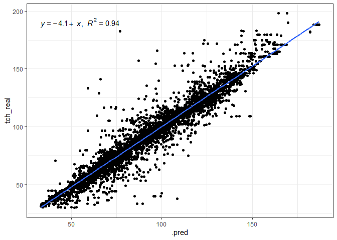

<!-- README.md is generated from README.Rmd. Please edit that file -->

# bigdata-sugarcane

### Carregando os pacotes

``` r
library("tidymodels")

library("tidyverse")
library("agricolae")
library("gclus")
library("cluster")
library("vegan")
library("lattice")
library("nortest")
library("rio")
library("gganimate")
library("corrplot")

library(readxl)
library(tidyverse)
library(geobr)
library(skimr)
library(ISLR)
library(modeldata)
library(vip)
library(ggpubr)
library(rpart.plot)
```

# Análise iniciais, básicas

### Carregando o banco de dados

``` r
data_set <-  readxl::read_xlsx("data/Big_03.xlsx",
                               na = "NA")
glimpse(data_set)
#> Rows: 53,654
#> Columns: 112
#> $ Chave          <dbl> 4412213, 4412213, 4412213, 4412314, 4412314, 4412313, 4…
#> $ FAZENDA        <dbl> 44122, 44122, 44122, 44123, 44123, 44123, 44123, 44123,…
#> $ QUADRA         <dbl> 1, 1, 1, 1, 1, 1, 1, 1, 1, 1, 1, 1, 1, 1, 1, 1, 1, 1, 1…
#> $ TALHAO         <dbl> 3, 3, 3, 4, 4, 3, 4, 2, 7, 2, 7, 11, 4, 5, 11, 7, 4, 2,…
#> $ FAZ_QUADRA     <dbl> 441221, 441221, 441221, 441231, 441231, 441231, 441231,…
#> $ FAZ_TALHAO     <dbl> 441223, 441223, 441223, 441234, 441234, 441233, 441234,…
#> $ UNIDADE        <chr> "CAT", "CAT", "CAT", "CAT", "CAT", "CAT", "CAT", "CAT",…
#> $ ponto          <chr> "CF1659867", "CF1659868", "CF1659869", "CF1659881", "CF…
#> $ X              <dbl> -49.01182, -49.00969, -49.01071, -48.99698, -48.99910, …
#> $ Y              <dbl> -21.57020, -21.56957, -21.56829, -21.56793, -21.56784, …
#> $ DATA           <dttm> 2016-10-27, 2016-10-27, 2016-10-27, 2016-11-22, 2016-1…
#> $ Ph_Cacl2_1     <dbl> 5.00, 4.98, 5.11, 5.52, 6.10, 5.82, 5.74, 5.77, 5.57, 5…
#> $ MO_1           <dbl> 21.2162, 18.8782, 14.4360, 13.3452, 14.2404, 12.6738, 1…
#> $ P_resina_1     <dbl> 9.27646, 8.75594, 7.06425, 10.53918, 10.53918, 10.67452…
#> $ S_1            <dbl> 7.83005, 5.42264, 5.21330, 5.29928, 4.67093, 11.45711, …
#> $ Ca_1           <dbl> 13.952941, 10.964706, 13.435294, 11.517857, 20.000000, …
#> $ Mg_1           <dbl> 5.314685, 6.503497, 6.923077, 4.635821, 11.620896, 6.49…
#> $ K_1            <dbl> 0.9774991, 1.1887667, 0.5687049, 0.6072340, 0.5987234, …
#> $ Al_1           <dbl> 0.480, 0.576, 0.384, 0.576, 0.672, 0.384, 0.480, 0.480,…
#> $ H_Al_1         <dbl> 19.60717, 16.05187, 14.44755, 14.83242, 13.21014, 12.53…
#> $ SB_1           <dbl> 20.24513, 18.65697, 20.92708, 16.76091, 32.21962, 24.03…
#> $ CTC_1          <dbl> 39.85229, 34.70883, 35.37463, 31.59333, 45.42976, 36.57…
#> $ V_1            <dbl> 50.80041, 53.75280, 59.15843, 53.05206, 70.92183, 65.73…
#> $ m_1            <dbl> 2.3160294, 2.9948574, 1.8018799, 3.3223910, 2.0430737, …
#> $ B_1            <dbl> NA, NA, NA, NA, NA, 0.2501072, NA, NA, NA, NA, NA, NA, …
#> $ Cu_1           <dbl> NA, NA, NA, NA, NA, 0.7327344, NA, NA, NA, NA, NA, NA, …
#> $ Fe_1           <dbl> NA, NA, NA, NA, NA, 42.09182, NA, NA, NA, NA, NA, NA, N…
#> $ Mn_1           <dbl> NA, NA, NA, NA, NA, 3.253708, NA, NA, NA, NA, NA, NA, N…
#> $ Zn_1           <dbl> NA, NA, NA, NA, NA, 0.3504326, NA, NA, NA, NA, NA, NA, …
#> $ Estagio        <dbl> 5, 5, 5, 5, 5, 5, 5, 5, 5, 5, 5, 5, 5, 5, 5, 5, 5, 5, 5…
#> $ Estagio_OP     <chr> "Soca", "Soca", "Soca", "Soca", "Soca", "Soca", "Soca",…
#> $ Ph_Cacl2_2     <dbl> 4.53, 5.00, 5.16, 5.71, 6.21, 6.11, 5.87, 5.68, 5.50, 5…
#> $ MO_2           <dbl> 17.0078, 12.5656, 11.3966, 11.1072, 16.4784, 11.7786, 1…
#> $ P_resina_2     <dbl> 7.19438, 6.41360, 6.28347, 12.43394, 11.08054, 10.40384…
#> $ S_2            <dbl> 7.62071, 6.46934, 8.03939, 4.79660, 4.79660, 5.04794, 5…
#> $ Ca_2           <dbl> 8.894118, 11.341176, 12.164706, 12.767857, 18.750000, 1…
#> $ Mg_2           <dbl> 4.973776, 6.354895, 6.232517, 5.282587, 12.536318, 7.19…
#> $ K_2            <dbl> 0.73703195, 0.97062865, 0.23033322, 0.57744681, 0.61148…
#> $ Al_2           <dbl> 2.016, 0.768, 0.288, 0.480, 0.576, 0.576, 0.576, 0.576,…
#> $ H_Al_2         <dbl> 18.02311, 15.71735, 12.73259, 14.83242, 12.14291, 11.52…
#> $ SB_2           <dbl> 14.60493, 18.66670, 18.62756, 18.62789, 31.89781, 24.63…
#> $ CTC_2          <dbl> 32.62804, 34.38405, 31.36015, 33.46031, 44.04071, 36.15…
#> $ V_2            <dbl> 44.76188, 54.28884, 59.39881, 55.67161, 72.42800, 68.13…
#> $ m_2            <dbl> 12.129288, 3.951695, 1.522556, 2.512051, 1.773737, 2.28…
#> $ B_2            <dbl> NA, NA, NA, NA, NA, 0.2696464, NA, NA, NA, NA, NA, NA, …
#> $ Cu_2           <dbl> NA, NA, NA, NA, NA, 0.4576081, NA, NA, NA, NA, NA, NA, …
#> $ Fe_2           <dbl> NA, NA, NA, NA, NA, 31.75250, NA, NA, NA, NA, NA, NA, N…
#> $ Mn_2           <dbl> NA, NA, NA, NA, NA, 2.480874, NA, NA, NA, NA, NA, NA, N…
#> $ Zn_2           <dbl> NA, NA, NA, NA, NA, 0.2906881, NA, NA, NA, NA, NA, NA, …
#> $ Ph_Cacl2_M     <dbl> 4.765, 4.990, 5.135, 5.615, 6.155, 5.965, 5.805, 5.725,…
#> $ MO_Media       <dbl> 19.1120, 15.7219, 12.9163, 12.2262, 15.3594, 12.2262, 1…
#> $ P_Media        <dbl> 8.235420, 7.584770, 6.673860, 11.486560, 10.809860, 10.…
#> $ S_Media        <dbl> 7.725380, 5.945990, 6.626345, 5.047940, 4.733765, 8.252…
#> $ Ca_Media       <dbl> 11.42353, 11.15294, 12.80000, 12.14286, 19.37500, 17.00…
#> $ Mg_Media       <dbl> 5.144231, 6.429196, 6.577797, 4.959204, 12.078607, 6.84…
#> $ K_Media        <dbl> 0.85726554, 1.07969770, 0.39951907, 0.59234043, 0.60510…
#> $ Al_Media       <dbl> 1.248, 0.672, 0.336, 0.528, 0.624, 0.480, 0.528, 0.528,…
#> $ H_Al_Media     <dbl> 18.81514, 15.88461, 13.59007, 14.83242, 12.67653, 12.02…
#> $ SB_Media       <dbl> 17.42503, 18.66183, 19.77732, 17.69440, 32.05871, 24.33…
#> $ CTC_Media      <dbl> 36.24017, 34.54644, 33.36739, 32.52682, 44.73524, 36.36…
#> $ V_Media        <dbl> 47.78114, 54.02082, 59.27862, 54.36183, 71.67491, 66.93…
#> $ m_Media        <dbl> 7.222659, 3.473276, 1.662218, 2.917221, 1.908405, 1.928…
#> $ B_Media        <dbl> NA, NA, NA, NA, NA, 0.2598768, NA, NA, NA, NA, NA, NA, …
#> $ Cu_Media       <dbl> NA, NA, NA, NA, NA, 0.5951713, NA, NA, NA, NA, NA, NA, …
#> $ Fe_Media       <dbl> NA, NA, NA, NA, NA, 36.92216, NA, NA, NA, NA, NA, NA, N…
#> $ Mn_Media       <dbl> NA, NA, NA, NA, NA, 2.867291, NA, NA, NA, NA, NA, NA, N…
#> $ Zn_Media       <dbl> NA, NA, NA, NA, NA, 0.3205604, NA, NA, NA, NA, NA, NA, …
#> $ CP_Cal_OP      <dbl> 3358.0600, 3104.4658, 2655.5507, 3224.4847, 0.0000, 153…
#> $ CP_Rec_V_O     <dbl> 750, 0, 0, 0, 0, 0, 0, 0, 0, 0, 0, 0, 0, 0, 750, 0, 0, …
#> $ CP_Rec_OP      <dbl> 750, 750, 750, 750, 750, 750, 750, 750, 750, 750, 750, …
#> $ Composto       <dbl> 2000, 2000, 2000, 1400, 1400, 1400, 1400, 1400, 1400, 2…
#> $ Agrofos        <dbl> 1100, 1100, 1100, 750, 750, 750, 750, 750, 750, 1100, 7…
#> $ CS_Cal_OP      <dbl> 1341.5467, 1566.4747, 1205.2036, 1730.7902, 0.0000, 795…
#> $ CS_Rec_OP      <dbl> 750, 750, 750, 750, 750, 750, 750, 750, 750, 750, 750, …
#> $ CS_Rec_V_O     <dbl> 750, 0, 0, 0, 0, 0, 0, 0, 0, 0, 0, 0, 0, 0, 750, 0, 0, …
#> $ Fosfato        <lgl> NA, NA, NA, NA, NA, NA, NA, NA, NA, NA, NA, NA, NA, NA,…
#> $ ANO            <dbl> 2016, 2016, 2016, 2016, 2016, 2016, 2016, 2016, 2016, 2…
#> $ chave          <dbl> 4412213, 4412213, 4412213, 4412314, 4412314, 4412313, 4…
#> $ unidade        <chr> "CAT", "CAT", "CAT", "CAT", "CAT", "CAT", "CAT", "CAT",…
#> $ ano            <dbl> 2016, 2016, 2016, 2016, 2016, 2016, 2016, 2016, 2016, 2…
#> $ mes            <dbl> 10, 10, 10, 10, 10, 10, 10, 10, 10, 10, 10, 10, 10, 10,…
#> $ fazenda        <dbl> 44122, 44122, 44122, 44123, 44123, 44123, 44123, 44123,…
#> $ quadra         <dbl> 1, 1, 1, 1, 1, 1, 1, 1, 1, 1, 1, 1, 1, 1, 1, 1, 1, 1, 1…
#> $ talhao         <dbl> 3, 3, 3, 4, 4, 3, 4, 2, 7, 2, 7, 11, 4, 5, 11, 7, 4, 2,…
#> $ area_ha        <dbl> 9.54, 9.54, 9.54, 13.55, 13.55, 5.65, 13.55, 2.04, 15.1…
#> $ variedade      <chr> "SP81-3250", "SP81-3250", "SP81-3250", "SP86-155", "SP8…
#> $ corte          <chr> "5ºC", "5ºC", "5ºC", "5ºC", "5ºC", "5ºC", "5ºC", "5ºC",…
#> $ distancia      <dbl> 85, 85, 85, 84, 84, 84, 84, 84, 84, 85, 84, 84, 84, 84,…
#> $ idade_obje     <dbl> 7.0, 7.0, 7.0, 6.8, 6.8, 6.8, 6.8, 6.8, 6.8, 7.0, 6.8, …
#> $ tch_objeti     <dbl> 50, 50, 50, 66, 66, 66, 66, 66, 66, 50, 66, 66, 66, 66,…
#> $ tc_objetiv     <dbl> 477.00, 477.00, 477.00, 894.30, 894.30, 372.90, 894.30,…
#> $ porcent_ob     <dbl> 0.07, 0.07, 0.07, 0.13, 0.13, 0.05, 0.13, 0.02, 0.14, 0…
#> $ idade_real     <dbl> 13.3, 13.3, 13.3, 13.2, 13.2, 13.2, 13.2, 13.2, 13.2, 1…
#> $ tch_real       <dbl> 51.13, 51.13, 51.13, 49.76, 49.76, 49.78, 49.76, 49.87,…
#> $ tc_real        <dbl> 487.75, 487.75, 487.75, 674.21, 674.21, 281.25, 674.21,…
#> $ porcent_re     <dbl> 0.08, 0.08, 0.08, 0.11, 0.11, 0.04, 0.11, 0.02, 0.12, 0…
#> $ variacao_p     <dbl> 2.25, 2.25, 2.25, -24.61, -24.61, -24.58, -24.61, -24.4…
#> $ variacao_t     <dbl> 10.75, 10.75, 10.75, -220.09, -220.09, -91.65, -220.09,…
#> $ aplic_vinh     <chr> "NAO", "NAO", "NAO", "NAO", "NAO", "NAO", "NAO", "NAO",…
#> $ consumo_to     <dbl> 0, 0, 0, 0, 0, 0, 0, 0, 0, 0, 0, 0, 0, 0, 0, 0, 0, 0, 0…
#> $ consumo_me     <dbl> 0, 0, 0, 0, 0, 0, 0, 0, 0, 0, 0, 0, 0, 0, 0, 0, 0, 0, 0…
#> $ data_vinha     <dbl> NA, NA, NA, NA, NA, NA, NA, NA, NA, NA, NA, NA, NA, NA,…
#> $ atr            <dbl> 150.57, 150.57, 150.57, 148.36, 148.36, 148.36, 148.36,…
#> $ tch_idade_real <dbl> 3.844361, 3.844361, 3.844361, 3.769697, 3.769697, 3.771…
#> $ solos          <chr> "LVd md", "LVd md", "LVd md", "LVPd md/md-arg", "LVPd m…
#> $ manejo         <chr> "LVd + al md", "LVd + al md", "LVd + al md", "LVPd + al…
#> $ ambiente       <chr> "D", "D", "D", "C", "C", "C", "C", "C", "C", "C", "C", …
#> $ textura_1      <chr> "Media", "Media", "Media", "Media", "Media", "Media", "…
#> $ textura_2      <chr> "Media", "Media", "Media", "Media-Argilosa", "Media-Arg…
#> $ nematoide      <chr> NA, NA, NA, NA, NA, NA, NA, NA, NA, NA, NA, NA, NA, NA,…
#> $ migdolus       <chr> "Ausente", "Ausente", "Ausente", "Ausente", "Ausente", …
#> $ sphenophorus   <chr> NA, NA, NA, NA, NA, NA, NA, NA, NA, NA, NA, NA, NA, NA,…
```

## Preparando o banco de dados

``` r
data_set[25795,names(data_set)=="B_2"] <- NA
data_set[6,names(data_set)=="B_2"]
#> # A tibble: 1 × 1
#>     B_2
#>   <dbl>
#> 1 0.270
data_set$B_2<-as.numeric(as.character(data_set$B_2))
```

``` r
data_set[18854,names(data_set)=="Cu_1"| names(data_set)=="Fe_1" | names(data_set)=="Mn_1" | names(data_set)=="Zn_1"]<-NA
data_set[27272,names(data_set)=="Cu_1"| names(data_set)=="Fe_1" | names(data_set)=="Mn_1" | names(data_set)=="Zn_1"]<-NA
data_set$Cu_1<-as.numeric(as.character(data_set$Cu_1))
data_set$Fe_1<-as.numeric(as.character(data_set$Fe_1))
data_set$Mn_1<-as.numeric(as.character(data_set$Mn_1))
data_set$Zn_1<-as.numeric(as.character(data_set$Zn_1))

UN<-as.character(data_set$UNIDADE)
un<-as.character(data_set$unidade)
UN[is.na(data_set$UNIDADE)]<-un[is.na(data_set$UNIDADE)]
data_set$UNIDADE<-factor(UN)

apv<-as.character(data_set$aplic_vinh)
apv[apv=="Sim"]<-"SIM"
data_set$aplic_vinh<-as.factor(apv)

vari<-sub(" ","",data_set$variedade)
vari<-sub("-","",vari)
vari<-sub("VIVEIRO","Viveiro",vari)
data_set$variedade<-as.factor(vari)

cort<-sub("15M","15m",data_set$corte)
data_set$corte<-as.factor(cort)
```

``` r
#Construindo o vetor numérico referente ao número de cortes
CORTE<-1:length(data_set[,1])
{CORTE[data_set$corte =="10ºC"] =10
CORTE[data_set$corte =="11ºC"] =11
CORTE[data_set$corte =="12m" ] =1
CORTE[data_set$corte =="12mB"] =1.5
CORTE[data_set$corte =="12mT"] =1.75
CORTE[data_set$corte =="15m" ]=1
CORTE[data_set$corte =="15mB" ]=1.5
CORTE[data_set$corte =="18m" ]=1.5
CORTE[data_set$corte =="18mB"] =1.5
CORTE[data_set$corte =="2ºC" ]=2
CORTE[data_set$corte =="2ºCB"] =2.5
CORTE[data_set$corte =="2ºCT"] =2.75
CORTE[data_set$corte =="3ºC"  ]=3
CORTE[data_set$corte =="3ºCB" ]=3.5
CORTE[data_set$corte =="4ºC"  ]=4
CORTE[data_set$corte =="4ºCB" ]=4.5
CORTE[data_set$corte =="5ºC"  ]=5
CORTE[data_set$corte =="5ºCB" ]=5.5
CORTE[data_set$corte =="6ºC"  ]=6
CORTE[data_set$corte =="6ºCB" ]=6.5
CORTE[data_set$corte =="7ºC" ]=7
CORTE[data_set$corte =="7ºCB" ]=7.5
CORTE[data_set$corte =="8ºC"  ]=8
CORTE[data_set$corte =="8ºCB" ]=8.5
CORTE[data_set$corte =="9ºC" ]=9
CORTE[data_set$corte =="9ºCB"] =9.5
CORTE[data_set$corte =="REF" ]=0}
```

``` r
data_set <- data_set %>% 
  janitor::clean_names()
```

## Análise por pontos coincidentes

``` r
# xy<-paste(data_set$X,data_set$Y,sep="") # vetor de caracter único para cada xy
# txy<-table(xy,data_set$ano)# Criamos a tabela de frência para cada coordenada
# fxy<-apply(txy[,1:3],1,sum)==3#filtro somente as coordenadas com a soma igual a 3
# lcoo3<-row.names(txy)[fxy]#Lista das coordenadas que apareceran nos três anos
# length(xy)
# length(lcoo3)
# ff<-vector()
# for( i in 1:length(lcoo3)){
#   f<-which(xy==lcoo3[i])
#   if(sum(data_set$ano[f]==c(2016,2017,2018))==3)  ff<-c(ff,f)
# }
# data_set$CORTE<-CORTE
# dc<-data_set[ff,]
# xyplot(X~Y| factor(ano),data=dc)

# Filtro das variáveis
# names(dc)
dc <- data_set %>% 
  select(tch_real,atr,corte,variedade,mes,ca_2,m_2,sb_2,idade_real,
              ctc_2,p_resina_2,h_al_2,v_2,k_2,mg_2,mo_2,ph_cacl2_2,s_2,ano)

# Separar o banco de dados por ano
data_set16<-dc %>% filter(ano==2016) %>% drop_na() %>% select(-ano)
data_set17<-dc %>% filter(ano==2017) %>% drop_na() %>% select(-ano)
data_set18<-dc %>% filter(ano==2018) %>% drop_na() %>% select(-ano)

# length(data_set16[,1]);length(data_set17[,1]);length(data_set18[,1]) # todos com o mesmo número de observações
# dC<-data_set[-ff,]
# length(data_set[,1]) == length(dc[,1]) + length(dC[,1])
# 
# bd<-data_set17
# names(bd)
```

``` r
visdat::vis_miss(data_set16)
```

<!-- -->

``` r
visdat::vis_miss(data_set17)
```

<!-- -->

``` r
visdat::vis_miss(data_set18)
```

<!-- -->

``` r
top_variedades <- data_set16 %>% 
  group_by(variedade) %>% 
  summarise(
    n=n()
  ) %>% arrange(desc(n)) %>% 
  head(7) %>% 
  pull(variedade) %>% as.character()


data_set_ml <- data_set16 %>% 
  mutate(
    variedade = forcats::fct_other(variedade, keep = top_variedades, other_level = "outro")) 

tch_initial_split <- initial_split(data_set_ml, prop = 0.70)
```

``` r
tch_train <- training(tch_initial_split)
tch_train  %>% 
  ggplot(aes(x=tch_real, y=..density..))+
  geom_histogram(bins = 30, color="black",  fill="lightgray")+
  geom_density(alpha=.05,fill="red")+
  theme_bw() +
  labs(x="tch", y = "Densidade")
```

<!-- -->

``` r
tch_recipe <- recipe(tch_real ~ ., data = tch_train ) %>%  
  step_normalize(all_numeric_predictors())  %>% 
  #step_novel(all_nominal_predictors()) %>% 
  step_zv(all_predictors())  #%>%
  #step_naomit(c(Ts, Us)) %>% 
  #step_impute_mean(c(Us,Ts)) %>% 
  #step_poly(c(ms,ts), degree = 5)  
  #step_dummy(all_nominal_predictors())
bake(prep(tch_recipe), new_data = NULL)
#> # A tibble: 14,842 × 18
#>        atr corte variedade    mes    ca_2    m_2    sb_2 idade_real    ctc_2
#>      <dbl> <fct> <fct>      <dbl>   <dbl>  <dbl>   <dbl>      <dbl>    <dbl>
#>  1  0.469  4ºC   RB867515   1.13   1.32   -0.490  1.20      -0.335   1.64   
#>  2  1.21   12m   IACSP9550  0.245 -0.464  -0.600  0.0299    -1.18   -0.384  
#>  3 -0.310  3ºC   RB867515  -0.640 -1.66    3.59  -1.59      -0.650  -1.58   
#>  4  0.659  7ºC   RB966928   1.57   2.73   -0.509  2.24       0.541   1.95   
#>  5  1.52   15m   CTC4       0.687 -0.181   0.673  0.176     -0.0895  0.493  
#>  6 -0.404  6ºCB  RB867515  -1.52  -1.66    5.19  -1.81       1.70   -1.39   
#>  7 -0.0924 2ºC   outro     -0.198 -1.16    0.600 -1.20      -0.230  -0.113  
#>  8  0.335  3ºC   RB867515   1.13   0.267  -0.320  0.409      1.63    0.116  
#>  9 -2.65   4ºC   RB92579   -0.640  0.0735  0.674  0.0301    -0.160  -0.00254
#> 10  0.355  12m   outro     -0.198  0.0566 -0.634  0.311     -1.53   -0.178  
#> # ℹ 14,832 more rows
#> # ℹ 9 more variables: p_resina_2 <dbl>, h_al_2 <dbl>, v_2 <dbl>, k_2 <dbl>,
#> #   mg_2 <dbl>, mo_2 <dbl>, ph_cacl2_2 <dbl>, s_2 <dbl>, tch_real <dbl>
```

``` r
tch_resamples <- vfold_cv(tch_train, v = 5)
grid <- grid_regular(
  penalty(range = c(-10, -2)),
  levels = 5
)
```

## Modelo Decision Tree

``` r
tch_dt_model <- decision_tree(
  cost_complexity = tune(),
  tree_depth = tune(),
  min_n = tune()
)  %>%  
  set_mode("regression")  %>%  
  set_engine("rpart")
```

``` r
tch_dt_recipe <- tch_recipe

tch_dt_wf <- workflow()   %>%  
  add_model(tch_dt_model) %>% 
  add_recipe(tch_dt_recipe)

grid_dt <- grid_random(
  cost_complexity(c(-20, -1)),
  tree_depth(range = c(2, 30)),
  min_n(range = c(2, 60)),
  size = 2
)
```

``` r
tch_dt_tune_grid <- tune_grid(
  tch_dt_wf,
  resamples = tch_resamples,
  grid = grid_dt,
  metrics = metric_set(rmse)
)
autoplot(tch_dt_tune_grid)
```

<!-- -->

``` r
collect_metrics(tch_dt_tune_grid)
#> # A tibble: 2 × 9
#>   cost_complexity tree_depth min_n .metric .estimator  mean     n std_err
#>             <dbl>      <int> <int> <chr>   <chr>      <dbl> <int>   <dbl>
#> 1        7.22e-12         23    51 rmse    standard    13.1     5   0.132
#> 2        7.23e-15          4    49 rmse    standard    18.2     5   0.192
#> # ℹ 1 more variable: .config <chr>

tch_dt_best_params <- select_best(tch_dt_tune_grid, "rmse")
tch_dt_wf <- tch_dt_wf %>% finalize_workflow(tch_dt_best_params)
tch_dt_last_fit <- last_fit(tch_dt_wf, tch_initial_split)

tch_test_preds <- bind_rows(
  collect_predictions(tch_dt_last_fit)  %>%   mutate(modelo = "dt")
)

tch_test <- testing(tch_initial_split)

tch_test_preds %>% 
  ggplot(aes(x=.pred, y=tch_real)) +
  geom_point()+
  theme_bw() +
  geom_smooth(method = "lm") +
  stat_regline_equation(ggplot2::aes(
  label =  paste(..eq.label.., ..rr.label.., sep = "*plain(\",\")~~"))) 
```

<!-- -->

``` r
tch_dt_last_fit_model <- tch_dt_last_fit$.workflow[[1]]$fit$fit
vip(tch_dt_last_fit_model)
```

<!-- -->

## Modelo Random Forest

``` r
tch_rf_model <- rand_forest(
  min_n = tune(),
  mtry = tune(),
  trees = tune()
)   %>%  
  set_mode("regression")  %>% 
  set_engine("randomForest")
```

``` r
tch_rf_wf <- workflow()   %>%  
  add_model(tch_rf_model) %>%  
  add_recipe(tch_recipe)
```

``` r
grid_rf <- grid_random(
  min_n(range = c(2, 7)),
  mtry(range = c(20,30)),
  trees(range = c(50,70)),
  size = 2
)
```

``` r
tch_rf_tune_grid <- tune_grid(
 tch_rf_wf,
  resamples = tch_resamples,
  grid = grid_rf,
  metrics = metric_set(rmse)
) 

autoplot(tch_rf_tune_grid)
```

<!-- -->

``` r
tch_rf_best_params <- select_best(tch_rf_tune_grid, "rmse")
tch_rf_wf <- tch_rf_wf %>% finalize_workflow(tch_rf_best_params)
tch_rf_last_fit <- last_fit(tch_rf_wf, tch_initial_split)

tch_test_preds <- bind_rows(
  collect_predictions(tch_rf_last_fit)  %>%   mutate(modelo = "rf")
)
```

``` r
tch_test <- testing(tch_initial_split)

tch_test_preds %>% 
  ggplot(aes(x=.pred, y=tch_real)) +
  geom_point()+
  theme_bw() +
  geom_smooth(method = "lm") +
  stat_regline_equation(ggplot2::aes(
  label =  paste(..eq.label.., ..rr.label.., sep = "*plain(\",\")~~"))) 
```

<!-- -->
